# HodgeReduction -- chain DAG (Mermaid)

Source nodes = kernel axioms (squares).  Sink nodes = endpoints
(hexagons).  Cuts = whitelisted open axioms (diamonds).  Drift
axioms = unwhitelisted axioms in the closure (highlighted).


```mermaid
graph TD
  classDef kernel fill:#eef,stroke:#557
  classDef cut fill:#ffd,stroke:#a80
  classDef drift fill:#fdd,stroke:#a00,stroke-width:3px
  classDef endpoint fill:#dfd,stroke:#080
  HodgeReduction_cy3_e7_j3o_nonrealization_stage{{ "cy3_e7_j3o_nonrealization_stage" }}:::cut
  HodgeReduction_cy3_mtd_isSemisimple{{ "cy3_mtd_isSemisimple" }}:::cut
  HodgeReduction_canonicalTargetInKnownE7Scope{{ "canonicalTargetInKnownE7Scope" }}:::cut
  HodgeReduction_cy3_e7_excludes_e6{{ "cy3_e7_excludes_e6" }}:::cut
  propext{{ "propext" }}:::cut
  HodgeReduction_abs_hodge_cm_implies_algebraic{{ "abs_hodge_cm_implies_algebraic" }}:::cut
  HodgeReduction_SmoothProjectiveVariety_algClasses{{ "algClasses" }}:::cut
  HodgeReduction_cy3_inherits_e7_factor{{ "cy3_inherits_e7_factor" }}:::cut
  HodgeReduction_e7_chosen_witness_correspondence_package_non_codim1_exists{{ "e7_chosen_witness_correspondence_package_non_codim1_exists" }}:::cut
  HodgeReduction_e7_chosen_witness_correspondence_package_codim1_exists{{ "e7_chosen_witness_correspondence_package_codim1_exists" }}:::cut
  HodgeReduction_e6_remainder_transfer{{ "e6_remainder_transfer" }}:::cut
  HodgeReduction_e6_classical_remainder_exists{{ "e6_classical_remainder_exists" }}:::cut
  HodgeReduction_absHodgeClassesAtDegreeCM{{ "absHodgeClassesAtDegreeCM" }}:::cut
  HodgeReduction_SmoothProjectiveVariety_cohomology{{ "cohomology" }}:::cut
  HodgeReduction_hc_real_classical_cartan{{ "hc_real_classical_cartan" }}:::cut
  HodgeReduction_canonicalTargetVariety{{ "canonicalTargetVariety" }}:::cut
  Classical_choice{{ "choice" }}:::cut
  HodgeReduction_cy3_e7_springer_stage{{ "cy3_e7_springer_stage" }}:::cut
  HodgeReduction_deligne_1982_abs_hodge_cm{{ "deligne_1982_abs_hodge_cm" }}:::cut
  HodgeReduction_e7_cm_witness_exists{{ "e7_cm_witness_exists" }}:::cut
  Quot_sound{{ "sound" }}:::cut
  HodgeReduction_cy3_e7_fts_omega_stage{{ "cy3_e7_fts_omega_stage" }}:::cut
  HodgeReduction_lefschetz_11_hc_real_at_codim1_cm{{ "lefschetz_11_hc_real_at_codim1_cm" }}:::cut
  HodgeReduction_canonicalTargetE7Factor{{ "canonicalTargetE7Factor" }}:::cut
  HodgeReduction_hodgeConjectureReal_canonical>"hodgeConjectureReal_canonical"]:::endpoint
  HodgeReduction_hodgeConjectureReal_canonical_codim1>"hodgeConjectureReal_canonical_codim1"]:::endpoint
  HodgeReduction_main_reduction_real>"main_reduction_real"]:::endpoint
  HodgeReduction_thm_Meyer>"thm_Meyer"]:::endpoint
  HodgeReduction_thm_G2F4>"thm_G2F4"]:::endpoint
  HodgeReduction_thm_E8_vacuous>"thm_E8_vacuous"]:::endpoint
  HodgeReduction_thm_cy3_e7_nonexistence>"thm_cy3_e7_nonexistence"]:::endpoint
  HodgeReduction_thm_subcase3b_vacuous>"thm_subcase3b_vacuous"]:::endpoint
  HodgeReduction_hodgeConjectureReal_canonical --> Classical_choice
  HodgeReduction_hodgeConjectureReal_canonical --> HodgeReduction_SmoothProjectiveVariety_algClasses
  HodgeReduction_hodgeConjectureReal_canonical --> HodgeReduction_SmoothProjectiveVariety_cohomology
  HodgeReduction_hodgeConjectureReal_canonical --> HodgeReduction_absHodgeClassesAtDegreeCM
  HodgeReduction_hodgeConjectureReal_canonical --> HodgeReduction_abs_hodge_cm_implies_algebraic
  HodgeReduction_hodgeConjectureReal_canonical --> HodgeReduction_canonicalTargetE7Factor
  HodgeReduction_hodgeConjectureReal_canonical --> HodgeReduction_canonicalTargetInKnownE7Scope
  HodgeReduction_hodgeConjectureReal_canonical --> HodgeReduction_canonicalTargetVariety
  HodgeReduction_hodgeConjectureReal_canonical --> HodgeReduction_deligne_1982_abs_hodge_cm
  HodgeReduction_hodgeConjectureReal_canonical --> HodgeReduction_e7_chosen_witness_correspondence_package_codim1_exists
  HodgeReduction_hodgeConjectureReal_canonical --> HodgeReduction_e7_chosen_witness_correspondence_package_non_codim1_exists
  HodgeReduction_hodgeConjectureReal_canonical --> HodgeReduction_e7_cm_witness_exists
  HodgeReduction_hodgeConjectureReal_canonical --> Quot_sound
  HodgeReduction_hodgeConjectureReal_canonical --> propext
  HodgeReduction_hodgeConjectureReal_canonical_codim1 --> Classical_choice
  HodgeReduction_hodgeConjectureReal_canonical_codim1 --> HodgeReduction_SmoothProjectiveVariety_algClasses
  HodgeReduction_hodgeConjectureReal_canonical_codim1 --> HodgeReduction_SmoothProjectiveVariety_cohomology
  HodgeReduction_hodgeConjectureReal_canonical_codim1 --> HodgeReduction_canonicalTargetE7Factor
  HodgeReduction_hodgeConjectureReal_canonical_codim1 --> HodgeReduction_canonicalTargetInKnownE7Scope
  HodgeReduction_hodgeConjectureReal_canonical_codim1 --> HodgeReduction_canonicalTargetVariety
  HodgeReduction_hodgeConjectureReal_canonical_codim1 --> HodgeReduction_e7_chosen_witness_correspondence_package_codim1_exists
  HodgeReduction_hodgeConjectureReal_canonical_codim1 --> HodgeReduction_e7_cm_witness_exists
  HodgeReduction_hodgeConjectureReal_canonical_codim1 --> HodgeReduction_lefschetz_11_hc_real_at_codim1_cm
  HodgeReduction_hodgeConjectureReal_canonical_codim1 --> Quot_sound
  HodgeReduction_hodgeConjectureReal_canonical_codim1 --> propext
  HodgeReduction_main_reduction_real --> Classical_choice
  HodgeReduction_main_reduction_real --> HodgeReduction_SmoothProjectiveVariety_algClasses
  HodgeReduction_main_reduction_real --> HodgeReduction_SmoothProjectiveVariety_cohomology
  HodgeReduction_main_reduction_real --> HodgeReduction_absHodgeClassesAtDegreeCM
  HodgeReduction_main_reduction_real --> HodgeReduction_abs_hodge_cm_implies_algebraic
  HodgeReduction_main_reduction_real --> HodgeReduction_cy3_e7_excludes_e6
  HodgeReduction_main_reduction_real --> HodgeReduction_cy3_e7_fts_omega_stage
  HodgeReduction_main_reduction_real --> HodgeReduction_cy3_e7_j3o_nonrealization_stage
  HodgeReduction_main_reduction_real --> HodgeReduction_cy3_e7_springer_stage
  HodgeReduction_main_reduction_real --> HodgeReduction_cy3_inherits_e7_factor
  HodgeReduction_main_reduction_real --> HodgeReduction_cy3_mtd_isSemisimple
  HodgeReduction_main_reduction_real --> HodgeReduction_deligne_1982_abs_hodge_cm
  HodgeReduction_main_reduction_real --> HodgeReduction_e6_classical_remainder_exists
  HodgeReduction_main_reduction_real --> HodgeReduction_e6_remainder_transfer
  HodgeReduction_main_reduction_real --> HodgeReduction_e7_chosen_witness_correspondence_package_codim1_exists
  HodgeReduction_main_reduction_real --> HodgeReduction_e7_chosen_witness_correspondence_package_non_codim1_exists
  HodgeReduction_main_reduction_real --> HodgeReduction_e7_cm_witness_exists
  HodgeReduction_main_reduction_real --> HodgeReduction_hc_real_classical_cartan
  HodgeReduction_main_reduction_real --> Quot_sound
  HodgeReduction_main_reduction_real --> propext
  HodgeReduction_thm_G2F4 --> Classical_choice
  HodgeReduction_thm_G2F4 --> Quot_sound
  HodgeReduction_thm_G2F4 --> propext
  HodgeReduction_thm_E8_vacuous --> Classical_choice
  HodgeReduction_thm_E8_vacuous --> Quot_sound
  HodgeReduction_thm_E8_vacuous --> propext
  HodgeReduction_thm_cy3_e7_nonexistence --> Classical_choice
  HodgeReduction_thm_cy3_e7_nonexistence --> HodgeReduction_cy3_e7_fts_omega_stage
  HodgeReduction_thm_cy3_e7_nonexistence --> HodgeReduction_cy3_e7_j3o_nonrealization_stage
  HodgeReduction_thm_cy3_e7_nonexistence --> HodgeReduction_cy3_e7_springer_stage
  HodgeReduction_thm_cy3_e7_nonexistence --> Quot_sound
  HodgeReduction_thm_cy3_e7_nonexistence --> propext
```


## Route Overlay (Generated)

The first graph is the endpoint/axiom trust DAG.  This overlay is generated from `researchChains` and `researchGaps`; use it to choose the next proof attack.  When `primaryGapId` and `replacementRouteId` are configured, the replacement edge is drawn explicitly and priority labels come from `gapPriority`.

```mermaid
graph TD
  classDef routeMain fill:#dfd,stroke:#080,stroke-width:2px
  classDef routeActive fill:#e7f0ff,stroke:#246,stroke-width:2px
  classDef routeSupport fill:#eef,stroke:#557
  classDef routeDead fill:#fdd,stroke:#a00,stroke-width:2px
  classDef gapOpen fill:#ffd,stroke:#a80,stroke-width:2px
  classDef gapClosed fill:#eee,stroke:#777
  classDef gapLegacy fill:#eee,stroke:#777,stroke-dasharray:3 3
  classDef gapDead fill:#fdd,stroke:#a00,stroke-dasharray:4 2
  chain_main_hc_axiom_relative["chain:main-hc-axiom-relative\nconditional"]:::routeMain
  chain_unconditional_classical["chain:unconditional-classical\nclosed-modulo-cy3-citation"]:::routeSupport
  chain_hcgap_l2_trivial_instances["chain:hcgap-l2-trivial-instances\nstable"]:::routeSupport
  chain_hcgap_l4_multifront_active["chain:hcgap-l4-multifront-active\nexploratory"]:::routeActive
  chain_concrete_evii_toy["chain:concrete-evii-toy\nclosed-toy"]:::routeSupport
  chain_historical_cone_audits["chain:historical-cone-audits\ninfra"]:::routeActive
  gap_G_main_hc{{"gap:G-main-hc\nconditional"}}:::gapOpen
  gap_G_l1_e7_shimura_tor{{"gap:G-l1-e7-shimura-tor\nopen"}}:::gapOpen
  gap_G_l2_cohomology_construction{{"gap:G-l2-cohomology-construction\nopen"}}:::gapOpen
  gap_G_l3_v56_mt_identification{{"gap:G-l3-v56-mt-identification\nopen"}}:::gapOpen
  gap_G_l4_cm_abelian_hc{{"gap:G-l4-cm-abelian-hc\nopen"}}:::gapOpen
  gap_G_l4_mt_correspondence{{"gap:G-l4-mt-correspondence\nopen"}}:::gapOpen
  gap_G_classical_mathlib_port{{"gap:G-classical-mathlib-port\ndeferred"}}:::gapOpen
  gap_G_hcgap_l4_multifront{{"gap:G-hcgap-l4-multifront\nactive-open"}}:::gapOpen
  chain_main_hc_axiom_relative -->|P9| gap_G_main_hc
  chain_main_hc_axiom_relative -->|P2| gap_G_l1_e7_shimura_tor
  chain_main_hc_axiom_relative -->|P3| gap_G_l2_cohomology_construction
  chain_main_hc_axiom_relative -->|P4| gap_G_l3_v56_mt_identification
  chain_main_hc_axiom_relative -->|P6| gap_G_l4_cm_abelian_hc
  chain_main_hc_axiom_relative -->|P5| gap_G_l4_mt_correspondence
  chain_unconditional_classical -->|P7| gap_G_classical_mathlib_port
  chain_main_hc_axiom_relative --> chain_hcgap_l2_trivial_instances
  chain_hcgap_l2_trivial_instances -->|P3| gap_G_l2_cohomology_construction
  chain_main_hc_axiom_relative --> chain_hcgap_l4_multifront_active
  chain_hcgap_l4_multifront_active -->|P8| gap_G_hcgap_l4_multifront
  chain_main_hc_axiom_relative --> chain_concrete_evii_toy
  chain_main_hc_axiom_relative --> chain_historical_cone_audits
```



