# HodgeReduction -- research map

Audit-generated route map overlaid on the automatic endpoint-closure audit.  The infra output is the single research truth source: use this report to distinguish the main chain, active exploration branches, named gaps, and dead or quarantined routes.

* research chains: **6**  *  named gaps: **8**  *  endpoint count: **8**  *  orphan debt files: **418**  *  taxonomy-labelled debt files: **12**  *  rule-labelled debt files: **409**  *  connectable debt files: **411**  *  build components: **28**  *  branch heads: **73**

## Decision Summary

This is the research base view.  Endpoint closure, route labels, and route states are generated by the audit infra from the Lean import graph, file content, file names, and the route taxonomy in the audit configuration.

Open mathematical cut(s):
- `HodgeReduction.SmoothProjectiveVariety.algClasses` at `HodgeReduction/OpenHypotheses.lean`
- `HodgeReduction.SmoothProjectiveVariety.cohomology` at `HodgeReduction/OpenHypotheses.lean`
- `HodgeReduction.absHodgeClassesAtDegreeCM` at `HodgeReduction/HCGapL4/CMAbelianHCBridge.lean`
- `HodgeReduction.abs_hodge_cm_implies_algebraic` at `HodgeReduction/HCGapL4/CMAbelianHCBridge.lean`
- `HodgeReduction.canonicalTargetE7Factor` at `HodgeReduction/OpenHypotheses.lean`
- `HodgeReduction.canonicalTargetInKnownE7Scope` at `HodgeReduction/OpenHypotheses.lean`
- `HodgeReduction.canonicalTargetVariety` at `HodgeReduction/OpenHypotheses.lean`
- `HodgeReduction.cy3_e7_excludes_e6` at `HodgeReduction/HCGapL4/CY3E7Bridge.lean`
- `HodgeReduction.cy3_e7_fts_omega_stage` at `HodgeReduction/HCGapL4/CY3NonexistenceStageCuts.lean`
- `HodgeReduction.cy3_e7_j3o_nonrealization_stage` at `HodgeReduction/HCGapL4/CY3NonexistenceStageCuts.lean`
- `HodgeReduction.cy3_e7_springer_stage` at `HodgeReduction/HCGapL4/CY3NonexistenceStageCuts.lean`
- `HodgeReduction.cy3_inherits_e7_factor` at `HodgeReduction/HCGapL4/CY3E7Bridge.lean`
- `HodgeReduction.cy3_mtd_isSemisimple` at `HodgeReduction/HCGapL4/CY3E7Bridge.lean`
- `HodgeReduction.deligne_1982_abs_hodge_cm` at `HodgeReduction/HCGapL4/CMAbelianHCBridge.lean`
- `HodgeReduction.e6_classical_remainder_exists` at `HodgeReduction/HCGapL4/E6CaseClassicalBridge.lean`
- `HodgeReduction.e6_remainder_transfer` at `HodgeReduction/HCGapL4/E6CaseClassicalBridge.lean`
- `HodgeReduction.e7_chosen_witness_alg_map_codim1` at `HodgeReduction/HCGapL4/MTWitnessDecomposition.lean`
- `HodgeReduction.e7_chosen_witness_correspondence_package_non_codim1_exists` at `HodgeReduction/HCGapL4/MTWitnessDecomposition.lean`
- `HodgeReduction.e7_chosen_witness_hodge_surj_codim1` at `HodgeReduction/HCGapL4/MTWitnessDecomposition.lean`
- `HodgeReduction.e7_chosen_witness_hsm_codim1` at `HodgeReduction/HCGapL4/MTWitnessDecomposition.lean`
- `HodgeReduction.e7_chosen_witness_square_codim1` at `HodgeReduction/HCGapL4/MTWitnessDecomposition.lean`
- `HodgeReduction.e7_cm_witness_exists` at `HodgeReduction/HCGapL4/MTWitnessDecomposition.lean`
- `HodgeReduction.hc_real_classical_cartan` at `HodgeReduction/MainTheorem.lean`
- `HodgeReduction.lefschetz_11_hc_real_at_codim1` at `HodgeReduction/HCGapL4/CMAbelianHCBridge.lean`

Active route(s) to work on:
- `hcgap-l4-multifront-active` (exploratory): gaps `G-hcgap-l4-multifront`

Dead/quarantined route(s):
- none

## Route Graph

```mermaid
graph TD
  classDef main fill:#dfd,stroke:#080,stroke-width:3px
  classDef active fill:#e8f3ff,stroke:#2670b8
  classDef support fill:#eef,stroke:#557
  classDef closed fill:#eee,stroke:#777
  classDef dead fill:#fdd,stroke:#a00,stroke-width:2px
  classDef gapOpen fill:#ffd,stroke:#a80
  classDef gapClosed fill:#eee,stroke:#777
  classDef gapDead fill:#fdd,stroke:#a00
  classDef debt fill:#fff7e6,stroke:#b87514
  classDef debtTaxonomy fill:#e8f3ff,stroke:#2670b8,stroke-dasharray:3 3
  classDef debtRule fill:#eefbea,stroke:#398439,stroke-dasharray:3 3
  classDef debtDead fill:#fdd,stroke:#a00,stroke-dasharray:3 3
  chain_main_hc_axiom_relative["Main Mumford--Tate-reduction HC chain\nconditional"]:::main
  chain_unconditional_classical["Unconditional classical paper theorems\nclosed-modulo-cy3-citation"]:::closed
  chain_hcgap_l2_trivial_instances["Layer-2 minimum attack: trivial-instance VarietyCohomologyData\nstable"]:::support
  chain_hcgap_l4_multifront_active["HCGapL4 multi-front attack waves (R420 -- R562)\nexploratory"]:::active
  chain_concrete_evii_toy["Concrete EVII sanity-check chain\nclosed-toy"]:::closed
  chain_historical_cone_audits["Historical per-round cone audit drivers (R217 -- R476)\ninfra"]:::support
  gap_G_main_hc{{"Hodge conjecture headline remains axiom-relative\nconditional"}}:::gapOpen
  gap_G_l1_e7_shimura_tor{{"Layer 1: true E_{7(-25)}-type Shimura toroidal compactification\nopen"}}:::gapOpen
  gap_G_l2_cohomology_construction{{"Layer 2: VarietyCohomologyData from a non-toy underlying variety\nopen"}}:::gapOpen
  gap_G_l3_v56_mt_identification{{"Layer 3: V_56 -- H^3(S_Γ^tor, -- Hodge-structure identification\nopen"}}:::gapOpen
  gap_G_l4_cm_abelian_hc{{"Layer 4-G2: Hodge conjecture for CM abelian varieties (Deligne 1982)\nopen"}}:::gapOpen
  gap_G_l4_mt_correspondence{{"Layer 4-G3: per-codim Mumford--Tate correspondence package (E_7 -> CM abelian)\nopen"}}:::gapOpen
  gap_G_classical_mathlib_port{{"Classical published-literature axioms awaiting Mathlib port\ndeferred"}}:::gapOpen
  gap_G_hcgap_l4_multifront{{"HCGapL4 multi-front Layer-4 attack waves (R420 -- R562)\nactive-open"}}:::gapOpen
  chain_main_hc_axiom_relative --> gap_G_main_hc
  chain_main_hc_axiom_relative --> gap_G_l1_e7_shimura_tor
  chain_main_hc_axiom_relative --> gap_G_l2_cohomology_construction
  chain_main_hc_axiom_relative --> gap_G_l3_v56_mt_identification
  chain_main_hc_axiom_relative --> gap_G_l4_cm_abelian_hc
  chain_main_hc_axiom_relative --> gap_G_l4_mt_correspondence
  chain_unconditional_classical --> gap_G_classical_mathlib_port
  chain_hcgap_l2_trivial_instances --> chain_main_hc_axiom_relative
  chain_hcgap_l2_trivial_instances --> gap_G_l2_cohomology_construction
  chain_hcgap_l4_multifront_active --> chain_main_hc_axiom_relative
  chain_hcgap_l4_multifront_active --> gap_G_hcgap_l4_multifront
  chain_concrete_evii_toy --> chain_main_hc_axiom_relative
  chain_historical_cone_audits --> chain_main_hc_axiom_relative
  debt_all["Orphan debt by actual imports\n418 files / 28 components / 73 heads"]:::debt
  chain_hcgap_l4_multifront_active --> debt_all
```

## Orphan Build Graph

This graph is derived from the actual Lean import graph restricted to off-chain debt files.  Each component is a connected build subgraph; files inside a component are listed chronologically in `orphan-debt.md`.  Owner edges are automatic route labels generated from imports, names, source text, and route taxonomy rules.

```mermaid
graph TD
  classDef debt fill:#fff7e6,stroke:#b87514
  classDef debtTaxonomy fill:#e8f3ff,stroke:#2670b8,stroke-dasharray:3 3
  classDef debtRule fill:#eefbea,stroke:#398439,stroke-dasharray:3 3
  classDef debtDead fill:#fdd,stroke:#a00,stroke-dasharray:3 3
  classDef anchor fill:#eef,stroke:#557
  classDef ownerChain fill:#e8f3ff,stroke:#2670b8
  classDef ownerGap fill:#ffd,stroke:#a80
  debt_root["All off-chain debt\n418 files / 73 heads"]:::debt
  anchor_on_chain["imports on-chain"]:::anchor
  anchor_cut["imports cut"]:::anchor
  anchor_quarantine["imports quarantine"]:::anchor
  anchor_infra["imports infra"]:::anchor
  anchor_project_unloaded["imports project-unloaded"]:::anchor
  owner_chain_concrete_evii_toy["chain:concrete-evii-toy"]:::ownerChain
  owner_chain_hcgap_l2_trivial_instances["chain:hcgap-l2-trivial-instances"]:::ownerChain
  owner_chain_hcgap_l4_multifront_active["chain:hcgap-l4-multifront-active"]:::ownerChain
  owner_chain_historical_cone_audits["chain:historical-cone-audits"]:::ownerChain
  owner_chain_main_hc_axiom_relative["chain:main-hc-axiom-relative"]:::ownerChain
  owner_chain_unconditional_classical["chain:unconditional-classical"]:::ownerChain
  owner_gap_G_classical_mathlib_port["gap:G-classical-mathlib-port"]:::ownerGap
  owner_gap_G_hcgap_l4_multifront["gap:G-hcgap-l4-multifront"]:::ownerGap
  owner_gap_G_l1_e7_shimura_tor["gap:G-l1-e7-shimura-tor"]:::ownerGap
  owner_gap_G_l2_cohomology_construction["gap:G-l2-cohomology-construction"]:::ownerGap
  owner_gap_G_l3_v56_mt_identification["gap:G-l3-v56-mt-identification"]:::ownerGap
  owner_gap_G_l4_cm_abelian_hc["gap:G-l4-cm-abelian-hc"]:::ownerGap
  owner_gap_G_l4_mt_correspondence["gap:G-l4-mt-correspondence"]:::ownerGap
  owner_gap_G_main_hc["gap:G-main-hc"]:::ownerGap
  debt_C001["C001\n97 files\n2026-05-29 17:54\ncore-support"]:::debtTaxonomy
  debt_root --> debt_C001
  debt_C001 --> anchor_cut
  debt_C001 --> anchor_infra
  debt_C001 --> anchor_on_chain
  owner_chain_concrete_evii_toy --> debt_C001
  owner_gap_G_l4_cm_abelian_hc --> debt_C001
  owner_chain_hcgap_l2_trivial_instances --> debt_C001
  owner_chain_hcgap_l4_multifront_active --> debt_C001
  owner_chain_historical_cone_audits --> debt_C001
  owner_chain_main_hc_axiom_relative --> debt_C001
  owner_chain_unconditional_classical --> debt_C001
  owner_gap_G_classical_mathlib_port --> debt_C001
  owner_gap_G_hcgap_l4_multifront --> debt_C001
  owner_gap_G_l1_e7_shimura_tor --> debt_C001
  owner_gap_G_l2_cohomology_construction --> debt_C001
  owner_gap_G_l3_v56_mt_identification --> debt_C001
  owner_gap_G_l4_mt_correspondence --> debt_C001
  owner_gap_G_main_hc --> debt_C001
  debt_C002["C002\n1 files\n2026-05-29 09:22\ncore-support"]:::debtRule
  debt_root --> debt_C002
  debt_C002 --> anchor_on_chain
  owner_chain_hcgap_l2_trivial_instances --> debt_C002
  owner_chain_main_hc_axiom_relative --> debt_C002
  owner_gap_G_l2_cohomology_construction --> debt_C002
  debt_C003["C003\n3 files\n2026-05-29 08:04\ncore-support"]:::debtRule
  debt_root --> debt_C003
  debt_C003 --> anchor_on_chain
  owner_chain_hcgap_l2_trivial_instances --> debt_C003
  owner_chain_main_hc_axiom_relative --> debt_C003
  owner_gap_G_l2_cohomology_construction --> debt_C003
  owner_gap_G_main_hc --> debt_C003
  debt_C004["C004\n291 files\n2026-05-29 05:45\ncore-support"]:::debtTaxonomy
  debt_root --> debt_C004
  debt_C004 --> anchor_cut
  debt_C004 --> anchor_on_chain
  owner_chain_hcgap_l4_multifront_active --> debt_C004
  owner_chain_historical_cone_audits --> debt_C004
  owner_gap_G_hcgap_l4_multifront --> debt_C004
  owner_chain_concrete_evii_toy --> debt_C004
  owner_chain_hcgap_l2_trivial_instances --> debt_C004
  owner_chain_main_hc_axiom_relative --> debt_C004
  owner_chain_unconditional_classical --> debt_C004
  owner_gap_G_classical_mathlib_port --> debt_C004
  owner_gap_G_l1_e7_shimura_tor --> debt_C004
  owner_gap_G_l2_cohomology_construction --> debt_C004
  owner_gap_G_l3_v56_mt_identification --> debt_C004
  owner_gap_G_l4_cm_abelian_hc --> debt_C004
  owner_gap_G_l4_mt_correspondence --> debt_C004
  owner_gap_G_main_hc --> debt_C004
  debt_C005["C005\n1 files\n2026-05-29 02:11\ncore-support"]:::debtRule
  debt_root --> debt_C005
  debt_C005 --> anchor_cut
  debt_C005 --> anchor_on_chain
  owner_chain_concrete_evii_toy --> debt_C005
  owner_chain_hcgap_l2_trivial_instances --> debt_C005
  owner_chain_hcgap_l4_multifront_active --> debt_C005
  owner_chain_main_hc_axiom_relative --> debt_C005
  owner_chain_unconditional_classical --> debt_C005
  owner_gap_G_classical_mathlib_port --> debt_C005
  owner_gap_G_hcgap_l4_multifront --> debt_C005
  owner_gap_G_l1_e7_shimura_tor --> debt_C005
  owner_gap_G_l2_cohomology_construction --> debt_C005
  owner_gap_G_l3_v56_mt_identification --> debt_C005
  owner_gap_G_l4_cm_abelian_hc --> debt_C005
  owner_gap_G_l4_mt_correspondence --> debt_C005
  owner_gap_G_main_hc --> debt_C005
  debt_C006["C006\n1 files\n2026-05-29 02:11\ncore-support"]:::debtRule
  debt_root --> debt_C006
  owner_chain_concrete_evii_toy --> debt_C006
  debt_C007["C007\n1 files\n2026-05-29 02:11\ncore-support"]:::debtTaxonomy
  debt_root --> debt_C007
  owner_gap_G_l1_e7_shimura_tor --> debt_C007
  owner_chain_main_hc_axiom_relative --> debt_C007
  debt_C008["C008\n1 files\n2026-05-29 02:11\ncore-support"]:::debtRule
  debt_root --> debt_C008
  owner_chain_hcgap_l2_trivial_instances --> debt_C008
  owner_chain_main_hc_axiom_relative --> debt_C008
  owner_chain_unconditional_classical --> debt_C008
  owner_gap_G_classical_mathlib_port --> debt_C008
  owner_gap_G_l2_cohomology_construction --> debt_C008
  debt_C009["C009\n1 files\n2026-05-29 02:11\ncore-support"]:::debtTaxonomy
  debt_root --> debt_C009
  owner_gap_G_l1_e7_shimura_tor --> debt_C009
  owner_chain_main_hc_axiom_relative --> debt_C009
  debt_C010["C010\n1 files\n2026-05-29 02:11\ncore-support"]:::debtRule
  debt_root --> debt_C010
  owner_chain_concrete_evii_toy --> debt_C010
  owner_chain_unconditional_classical --> debt_C010
  owner_gap_G_classical_mathlib_port --> debt_C010
  debt_C011["C011\n1 files\n2026-05-29 02:11\ncore-support"]:::debtRule
  debt_root --> debt_C011
  owner_chain_main_hc_axiom_relative --> debt_C011
  owner_gap_G_l3_v56_mt_identification --> debt_C011
  debt_C012["C012\n1 files\n2026-05-29 02:11\ncore-support"]:::debtRule
  debt_root --> debt_C012
  owner_chain_main_hc_axiom_relative --> debt_C012
  owner_chain_unconditional_classical --> debt_C012
  owner_gap_G_classical_mathlib_port --> debt_C012
  owner_gap_G_l3_v56_mt_identification --> debt_C012
  debt_C013["C013\n1 files\n2026-05-29 02:11\ncore-support"]:::debtRule
  debt_root --> debt_C013
  owner_chain_concrete_evii_toy --> debt_C013
  owner_chain_main_hc_axiom_relative --> debt_C013
  owner_chain_unconditional_classical --> debt_C013
  owner_gap_G_classical_mathlib_port --> debt_C013
  owner_gap_G_l3_v56_mt_identification --> debt_C013
  debt_C014["C014\n1 files\n2026-05-29 02:11\ncore-support"]:::debtRule
  debt_root --> debt_C014
  owner_chain_concrete_evii_toy --> debt_C014
  debt_C015["C015\n1 files\n2026-05-29 02:11\ncore-support"]:::debtRule
  debt_root --> debt_C015
  owner_chain_hcgap_l2_trivial_instances --> debt_C015
  owner_chain_main_hc_axiom_relative --> debt_C015
  owner_gap_G_l2_cohomology_construction --> debt_C015
  debt_C016["C016\n1 files\n2026-05-29 02:11\ncore-support"]:::debtRule
  debt_root --> debt_C016
  owner_chain_concrete_evii_toy --> debt_C016
  debt_C017["C017\n3 files\n2026-05-29 02:11\ncore-support"]:::debtRule
  debt_root --> debt_C017
  owner_chain_hcgap_l2_trivial_instances --> debt_C017
  owner_chain_main_hc_axiom_relative --> debt_C017
  owner_gap_G_l2_cohomology_construction --> debt_C017
  debt_C018["C018\n1 files\n2026-05-29 02:11\ncore-support"]:::debt
  debt_root --> debt_C018
  debt_C019["C019\n1 files\n2026-05-29 02:11\ncore-support"]:::debtRule
  debt_root --> debt_C019
  owner_chain_main_hc_axiom_relative --> debt_C019
  owner_gap_G_l3_v56_mt_identification --> debt_C019
  debt_C020["C020\n1 files\n2026-05-29 02:11\ncore-support"]:::debtRule
  debt_root --> debt_C020
  owner_chain_unconditional_classical --> debt_C020
  owner_gap_G_classical_mathlib_port --> debt_C020
  debt_C021["C021\n1 files\n2026-05-29 02:11\ncore-support"]:::debtRule
  debt_root --> debt_C021
  owner_chain_concrete_evii_toy --> debt_C021
  owner_chain_main_hc_axiom_relative --> debt_C021
  owner_gap_G_l3_v56_mt_identification --> debt_C021
  debt_C022["C022\n1 files\n2026-05-29 02:11\ncore-support"]:::debtRule
  debt_root --> debt_C022
  owner_chain_concrete_evii_toy --> debt_C022
  owner_chain_historical_cone_audits --> debt_C022
  debt_C023["C023\n1 files\n2026-05-29 02:11\ncore-support"]:::debtRule
  debt_root --> debt_C023
  owner_chain_main_hc_axiom_relative --> debt_C023
  owner_gap_G_l4_cm_abelian_hc --> debt_C023
  debt_C024["C024\n1 files\n2026-05-29 02:11\ncore-support"]:::debtRule
  debt_root --> debt_C024
  owner_chain_main_hc_axiom_relative --> debt_C024
  owner_gap_G_l4_cm_abelian_hc --> debt_C024
  debt_C025["C025\n1 files\n2026-05-29 02:11\ncore-support"]:::debtRule
  debt_root --> debt_C025
  owner_chain_concrete_evii_toy --> debt_C025
  owner_chain_hcgap_l2_trivial_instances --> debt_C025
  owner_chain_main_hc_axiom_relative --> debt_C025
  owner_gap_G_l2_cohomology_construction --> debt_C025
  owner_gap_G_l4_cm_abelian_hc --> debt_C025
  debt_C026["C026\n1 files\n2026-05-29 02:11\ncore-support"]:::debtTaxonomy
  debt_root --> debt_C026
  owner_gap_G_l4_cm_abelian_hc --> debt_C026
  owner_chain_concrete_evii_toy --> debt_C026
  owner_chain_main_hc_axiom_relative --> debt_C026
  debt_C027["C027\n1 files\n2026-05-29 02:11\ncore-support"]:::debtRule
  debt_root --> debt_C027
  owner_chain_hcgap_l2_trivial_instances --> debt_C027
  owner_chain_hcgap_l4_multifront_active --> debt_C027
  owner_chain_main_hc_axiom_relative --> debt_C027
  owner_gap_G_hcgap_l4_multifront --> debt_C027
  owner_gap_G_l1_e7_shimura_tor --> debt_C027
  owner_gap_G_l2_cohomology_construction --> debt_C027
  owner_gap_G_l4_cm_abelian_hc --> debt_C027
  owner_gap_G_l4_mt_correspondence --> debt_C027
  owner_gap_G_main_hc --> debt_C027
  debt_C028["C028\n1 files\n2026-05-29 02:11\ncore-support"]:::debtRule
  debt_root --> debt_C028
  debt_C028 --> anchor_cut
  owner_chain_concrete_evii_toy --> debt_C028
  owner_chain_hcgap_l2_trivial_instances --> debt_C028
  owner_chain_hcgap_l4_multifront_active --> debt_C028
  owner_chain_historical_cone_audits --> debt_C028
  owner_chain_main_hc_axiom_relative --> debt_C028
  owner_chain_unconditional_classical --> debt_C028
  owner_gap_G_hcgap_l4_multifront --> debt_C028
  owner_gap_G_l1_e7_shimura_tor --> debt_C028
  owner_gap_G_l2_cohomology_construction --> debt_C028
  owner_gap_G_l4_cm_abelian_hc --> debt_C028
  owner_gap_G_l4_mt_correspondence --> debt_C028
  owner_gap_G_main_hc --> debt_C028
```

## Chains

| id | kind | status | gaps | file classes |
|----|------|--------|------|--------------|
| `main-hc-axiom-relative` | main | conditional | `G-main-hc`, `G-l1-e7-shimura-tor`, `G-l2-cohomology-construction`, `G-l3-v56-mt-identification`, `G-l4-cm-abelian-hc`, `G-l4-mt-correspondence` | cut: 2, infra: 1, on-chain: 2 |
| `unconditional-classical` | support | closed-modulo-cy3-citation | `G-classical-mathlib-port` | cut: 1, on-chain: 1 |
| `hcgap-l2-trivial-instances` | support | stable | `G-l2-cohomology-construction` | registered: 3 |
| `hcgap-l4-multifront-active` | active | exploratory | `G-hcgap-l4-multifront` | on-disk-unloaded: 3, registered: 21 |
| `concrete-evii-toy` | support | closed-toy | - | on-disk-unloaded: 1 |
| `historical-cone-audits` | infra | infra | - | on-disk-unloaded: 4 |

## Gaps

| id | status | title | files |
|----|--------|-------|-------|
| `G-main-hc` | conditional | Hodge conjecture headline remains axiom-relative | cut: 2, infra: 1, on-chain: 1 |
| `G-l1-e7-shimura-tor` | open | Layer 1: true E_{7(-25)}-type Shimura toroidal compactification | cut: 1, infra: 1, on-disk-unloaded: 2, registered: 1 |
| `G-l2-cohomology-construction` | open | Layer 2: VarietyCohomologyData from a non-toy underlying variety | infra: 1, on-chain: 1, registered: 4 |
| `G-l3-v56-mt-identification` | open | Layer 3: V_56 -- H^3(S_Γ^tor, -- Hodge-structure identification | infra: 1, registered: 4 |
| `G-l4-cm-abelian-hc` | open | Layer 4-G2: Hodge conjecture for CM abelian varieties (Deligne 1982) | cut: 2, infra: 1, on-disk-unloaded: 2 |
| `G-l4-mt-correspondence` | open | Layer 4-G3: per-codim Mumford--Tate correspondence package (E_7 -> CM abelian) | cut: 3, infra: 1, registered: 1 |
| `G-classical-mathlib-port` | deferred | Classical published-literature axioms awaiting Mathlib port | cut: 3, on-chain: 2 |
| `G-hcgap-l4-multifront` | active-open | HCGapL4 multi-front Layer-4 attack waves (R420 -- R562) | on-disk-unloaded: 3, registered: 26 |

## Off-Chain Split

Route-labelled off-chain files are assigned by the audit infra but are not consumed by an endpoint closure yet.  Unlabelled debt is grouped by actual Lean import connectivity in `orphan-debt.md`.

* taxonomy-entry off-chain files: **12**
* taxonomy-labelled debt files: **12**
* rule-labelled debt files: **409**
* unconnected debt files: **7**
* unlabelled off-chain debt files: **406**
* build-connected debt components: **28**

| path | audit route labels | audit class |
|------|----------------|-------------|
| `HodgeReduction/Concrete.lean` | `chain:concrete-evii-toy`, `chain:hcgap-l2-trivial-instances`, `chain:main-hc-axiom-relative`, `gap:G-l2-cohomology-construction`, `gap:G-l3-v56-mt-identification` | on-disk-unloaded |
| `HodgeReduction/ConeAudits/R217_ConeAudit.lean` | `chain:hcgap-l2-trivial-instances`, `chain:hcgap-l4-multifront-active`, `chain:historical-cone-audits`, `chain:main-hc-axiom-relative`, `chain:unconditional-classical`, `gap:G-hcgap-l4-multifront`, `gap:G-l2-cohomology-construction`, `gap:G-l4-cm-abelian-hc`, `gap:G-l4-mt-correspondence`, `gap:G-main-hc` | on-disk-unloaded |
| `HodgeReduction/ConeAudits/R467_R470_ConeAudit.lean` | `chain:hcgap-l4-multifront-active`, `chain:historical-cone-audits`, `chain:main-hc-axiom-relative`, `chain:unconditional-classical`, `gap:G-hcgap-l4-multifront`, `gap:G-l1-e7-shimura-tor`, `gap:G-l4-cm-abelian-hc`, `gap:G-l4-mt-correspondence`, `gap:G-main-hc` | on-disk-unloaded |
| `HodgeReduction/ConeAudits/R471_R476_ConeAudit.lean` | `chain:hcgap-l4-multifront-active`, `chain:historical-cone-audits`, `chain:main-hc-axiom-relative`, `chain:unconditional-classical`, `gap:G-hcgap-l4-multifront`, `gap:G-l4-cm-abelian-hc`, `gap:G-l4-mt-correspondence`, `gap:G-main-hc` | on-disk-unloaded |
| `HodgeReduction/ConeAudits/R477_R480_ConeAudit.lean` | `chain:concrete-evii-toy`, `chain:hcgap-l4-multifront-active`, `chain:historical-cone-audits`, `chain:main-hc-axiom-relative`, `chain:unconditional-classical`, `gap:G-hcgap-l4-multifront`, `gap:G-l3-v56-mt-identification`, `gap:G-l4-cm-abelian-hc`, `gap:G-l4-mt-correspondence`, `gap:G-main-hc` | on-disk-unloaded |
| `HodgeReduction/HCGapL4/FrontD6_Deligne1982MinimalFragment.lean` | `chain:hcgap-l4-multifront-active`, `chain:main-hc-axiom-relative`, `gap:G-hcgap-l4-multifront`, `gap:G-l1-e7-shimura-tor`, `gap:G-l4-cm-abelian-hc`, `gap:G-l4-mt-correspondence`, `gap:G-main-hc` | on-disk-unloaded |
| `HodgeReduction/HCGapL4/FrontE6_FeedR405ConditionalTransfer.lean` | `chain:hcgap-l4-multifront-active`, `gap:G-hcgap-l4-multifront` | on-disk-unloaded |
| `HodgeReduction/HCGapL4/R476_MultiFrontWave6Audit.lean` | `chain:hcgap-l4-multifront-active`, `gap:G-hcgap-l4-multifront` | on-disk-unloaded |
| `HodgeReduction/Infrastructure/AbelianVariety/CMType.lean` | `chain:concrete-evii-toy`, `chain:main-hc-axiom-relative`, `gap:G-l4-cm-abelian-hc` | on-disk-unloaded |
| `HodgeReduction/Infrastructure/AbelianVariety/KugaSatake.lean` | `chain:concrete-evii-toy`, `chain:hcgap-l2-trivial-instances`, `chain:main-hc-axiom-relative`, `gap:G-l2-cohomology-construction`, `gap:G-l4-cm-abelian-hc` | on-disk-unloaded |
| `HodgeReduction/Infrastructure/Shimura/ArithmeticGroup.lean` | `chain:main-hc-axiom-relative`, `gap:G-l1-e7-shimura-tor` | on-disk-unloaded |
| `HodgeReduction/Infrastructure/Shimura/HermitianSymmetric.lean` | `chain:main-hc-axiom-relative`, `gap:G-l1-e7-shimura-tor` | on-disk-unloaded |

## Chain Details

### `main-hc-axiom-relative` -- Main Mumford--Tate-reduction HC chain

`OpenHypotheses` (R169 cohomology / algClasses bridge + R174a Deligne) composes with `MainTheorem` (R170 four-case main reduction + R171/R188/R542/R551 canonical headline) to reach `hodgeConjectureReal_canonical`.  R546 adds the separately audited codim-one endpoint `hodgeConjectureReal_canonical_codim1`; R550 reroutes it directly through the classical Lefschetz (1,1) cut; R551 uses that endpoint for the `p = 1` branch of the full canonical proof, uses the direct non-codim-one MT package for `p ≠ 1`, and avoids mentioning `canonicalHCDataByCodim` in the endpoint type.  Full HC remains conditional on a canonical target SPV, its E7 factor/scope facts, the non-codim-one MT-witness route, and the CM-source all-codim bridge for `p ≠ 1`.

Entry declarations:
- `HodgeReduction.hodgeConjectureReal_canonical`
- `HodgeReduction.hodgeConjectureReal_canonical_codim1`
- `HodgeReduction.main_reduction_real`

Gaps: `G-main-hc`, `G-l1-e7-shimura-tor`, `G-l2-cohomology-construction`, `G-l3-v56-mt-identification`, `G-l4-cm-abelian-hc`, `G-l4-mt-correspondence`

Files:
- `HodgeReduction/Types.lean` -- on-chain
- `HodgeReduction/ClassicalResults.lean` -- on-chain
- `HodgeReduction/OpenHypotheses.lean` -- cut
- `HodgeReduction/MainTheorem.lean` -- cut
- `HodgeReduction/HCGapRegistry.lean` -- infra

### `unconditional-classical` -- Unconditional classical paper theorems

Meyer / G_2 / F_4 / E_8 vacuity are kernel-pure derived theorems.  `thm_cy3_e7_nonexistence` still consumes `cy3_e7_nonexistence_paper_axiom` (paper §4 Stages A--D).

Entry declarations:
- `HodgeReduction.thm_Meyer`
- `HodgeReduction.thm_G2F4`
- `HodgeReduction.thm_E8_vacuous`
- `HodgeReduction.thm_cy3_e7_nonexistence`
- `HodgeReduction.thm_subcase3b_vacuous`

Gaps: `G-classical-mathlib-port`

Files:
- `HodgeReduction/ClassicalResults.lean` -- on-chain
- `HodgeReduction/MainTheorem.lean` -- cut

### `hcgap-l2-trivial-instances` -- Layer-2 minimum attack: trivial-instance VarietyCohomologyData

R201 minimum-attack instances of `VarietyCohomologyData`: trivial point (dim 0), projective line (dim 1), elliptic curve (dim 1).  Provides the template that a future E_7 construction must follow.

Depends on: `main-hc-axiom-relative`

Gaps: `G-l2-cohomology-construction`

Files:
- `HodgeReduction/HCGapL2/TrivialPoint.lean` -- registered
- `HodgeReduction/HCGapL2/ProjectiveLine.lean` -- registered
- `HodgeReduction/HCGapL2/EllipticCurve.lean` -- registered

### `hcgap-l4-multifront-active` -- HCGapL4 multi-front attack waves (R420 -- R562)

5 parallel attack fronts on the L4 cohomology-profile + connectedness pipeline.  Per-wave audits R451 / R456 / R460 / R465 / R470 / R476 enumerate substantive theorems per round.  R552 extends the FrontC numeric bridge through a buildable EVII compact-dual/V56/Shimura expected Betti profile: all degrees 0..8 are certified by known Hodge sums, with degree 3 explicitly routed through V56 rather than hidden in compact-dual odd cohomology.  R553 connects that finite V56 profile to the actual infrastructure `PureHodgeStructure V56 3`.  R554 proves the abstract Matsushima boundary composition: target invariants reduce to the cuspidal trivial-module part, and compact-dual image reduces to that part once concrete EVII source/target boundary equalities are provided.  R555 tightens the source-side obligation: Cartan's trivial-module H8 line rewrites to compact-dual H8, its classes are algebraic through `CompactDualData`, and the R554 source equality follows from `surjectivity_source = source_invariants`.  R556 converts the remaining boundary equalities into four concrete linear-algebra tasks; R557 shows target containment is forced by source containment; R558 transports target finrank from source finrank; R559 rewrites the remaining source obligations against compact-dual/Cartan data; R560 proves those obligations are not derivable from the current abstract interface alone; R561 replaces the three R559 obligations by the sharper compact-dual exact image target plus target-invariant exactness; R562 removes target-invariant exactness as an independent obligation by deriving it from exact image plus the compactDual/trivialModulePart rank bridge.  The route remains exploratory, not a closure claim.

Entry declarations:
- `HodgeReduction.HCGapL4.FrontC11_ShimuraBettiComputation.shimuraEVIIExpectedBettiKnownHodgeSumCertification_current`
- `HodgeReduction.HCGapL4.FrontC11_ShimuraBettiComputation.shimura_expected_known_hodgeSum_total`
- `HodgeReduction.HCGapL4.FrontC12_V56InfrastructureProfileBridge.v56InfrastructureProfileCertification_current`
- `HodgeReduction.HCGapL4.FrontC13_MatsushimaV56BoundaryBridge.matsushima_compactDual_image_eq_trivialModulePart`
- `HodgeReduction.HCGapL4.FrontC13_MatsushimaV56BoundaryBridge.matsushimaV56BoundaryCertification_from_boundary`
- `HodgeReduction.HCGapL4.FrontC14_CartanCompactDualSourceBridge.cartan_trivialModuleGK_H8_classes_are_algebraic`
- `HodgeReduction.HCGapL4.FrontC14_CartanCompactDualSourceBridge.matsushimaV56BoundaryData_of_source_target_invariants`
- `HodgeReduction.HCGapL4.FrontC14_CartanCompactDualSourceBridge.cartanCompactDualSourceCertification_current`
- `HodgeReduction.HCGapL4.FrontC15_MatsushimaBoundaryRankCriterion.source_eq_invariants_of_le_finrank`
- `HodgeReduction.HCGapL4.FrontC15_MatsushimaBoundaryRankCriterion.target_eq_trivialModulePart_of_le_finrank`
- `HodgeReduction.HCGapL4.FrontC15_MatsushimaBoundaryRankCriterion.matsushimaV56BoundaryData_of_rank_criteria`
- `HodgeReduction.HCGapL4.FrontC16_MatsushimaTargetContainmentFromSource.surjectivity_target_le_trivialModulePart_of_source_le`
- `HodgeReduction.HCGapL4.FrontC16_MatsushimaTargetContainmentFromSource.target_eq_invariants_of_source_le_target_finrank`
- `HodgeReduction.HCGapL4.FrontC16_MatsushimaTargetContainmentFromSource.matsushimaV56BoundaryData_of_source_le_source_rank_target_rank`
- `HodgeReduction.HCGapL4.FrontC17_MatsushimaTargetRankFromSource.surjectivity_target_finrank_eq_source`
- `HodgeReduction.HCGapL4.FrontC17_MatsushimaTargetRankFromSource.target_finrank_eq_trivialModulePart_of_source_finrank_trivial`
- `HodgeReduction.HCGapL4.FrontC17_MatsushimaTargetRankFromSource.matsushimaV56BoundaryData_of_source_le_source_rank_source_to_trivial_rank`
- `HodgeReduction.HCGapL4.FrontC18_MatsushimaSourceCompactDualRankBridge.source_eq_invariants_of_source_le_compactDual_rank`
- `HodgeReduction.HCGapL4.FrontC18_MatsushimaSourceCompactDualRankBridge.source_finrank_eq_trivialModulePart_of_compactDual_rank`
- `HodgeReduction.HCGapL4.FrontC18_MatsushimaSourceCompactDualRankBridge.matsushimaV56BoundaryData_of_source_le_compactDual_rank_compactDual_to_trivial_rank`
- `HodgeReduction.HCGapL4.FrontC19_MatsushimaSourceCompactDualObstruction.current_interface_does_not_force_R559_targets`
- `HodgeReduction.HCGapL4.FrontC20_MatsushimaCompactDualExactImageCriterion.source_eq_compactDual_of_compactDual_image_eq_surjectivity_target`
- `HodgeReduction.HCGapL4.FrontC20_MatsushimaCompactDualExactImageCriterion.compactDual_finrank_eq_trivialModulePart_of_exact_image_target_eq`
- `HodgeReduction.HCGapL4.FrontC20_MatsushimaCompactDualExactImageCriterion.matsushimaV56BoundaryData_of_compactDual_exact_image_target_eq`
- `HodgeReduction.HCGapL4.FrontC21_MatsushimaExactImageRankBoundary.target_eq_invariants_of_compactDual_exact_image_trivial_rank`
- `HodgeReduction.HCGapL4.FrontC21_MatsushimaExactImageRankBoundary.matsushimaV56BoundaryData_of_compactDual_exact_image_trivial_rank`
- `HodgeReduction.HCGapL4.FrontC21_MatsushimaExactImageRankBoundary.matsushima_compactDual_image_eq_trivialModulePart_of_exact_image_rank`

Depends on: `main-hc-axiom-relative`

Gaps: `G-hcgap-l4-multifront`

Files:
- `HodgeReduction/HCGapL4/FrontA_DeligneH0SheafRealization.lean` -- registered
- `HodgeReduction/HCGapL4/FrontB_BailyBorelConnectedness.lean` -- registered
- `HodgeReduction/HCGapL4/FrontC_E7LowDegreeHodgeNumbers.lean` -- registered
- `HodgeReduction/HCGapL4/FrontD_E7ToCMChowCorrespondence.lean` -- registered
- `HodgeReduction/HCGapL4/FrontE_RealCarrierProfileMatching.lean` -- registered
- `HodgeReduction/HCGapL4/FrontC6_AllDegreeHodgeRankAdapter.lean` -- registered
- `HodgeReduction/HCGapL4/FrontC7_E7EVIIHodgeDiamondInstance.lean` -- registered
- `HodgeReduction/HCGapL4/FrontC8_V56MTBridge.lean` -- registered
- `HodgeReduction/HCGapL4/FrontC9_EVIIHodgeNumberComputation.lean` -- registered
- `HodgeReduction/HCGapL4/FrontC10_V56CohomologyIdentification.lean` -- registered
- `HodgeReduction/HCGapL4/FrontC11_ShimuraBettiComputation.lean` -- registered
- `HodgeReduction/HCGapL4/FrontC12_V56InfrastructureProfileBridge.lean` -- registered
- `HodgeReduction/HCGapL4/FrontC13_MatsushimaV56BoundaryBridge.lean` -- registered
- `HodgeReduction/HCGapL4/FrontC14_CartanCompactDualSourceBridge.lean` -- registered
- `HodgeReduction/HCGapL4/FrontC15_MatsushimaBoundaryRankCriterion.lean` -- registered
- `HodgeReduction/HCGapL4/FrontC16_MatsushimaTargetContainmentFromSource.lean` -- registered
- `HodgeReduction/HCGapL4/FrontC17_MatsushimaTargetRankFromSource.lean` -- registered
- `HodgeReduction/HCGapL4/FrontC18_MatsushimaSourceCompactDualRankBridge.lean` -- registered
- `HodgeReduction/HCGapL4/FrontC19_MatsushimaSourceCompactDualObstruction.lean` -- registered
- `HodgeReduction/HCGapL4/FrontC20_MatsushimaCompactDualExactImageCriterion.lean` -- registered
- `HodgeReduction/HCGapL4/FrontC21_MatsushimaExactImageRankBoundary.lean` -- registered
- `HodgeReduction/HCGapL4/FrontE6_FeedR405ConditionalTransfer.lean` -- on-disk-unloaded
- `HodgeReduction/HCGapL4/FrontD6_Deligne1982MinimalFragment.lean` -- on-disk-unloaded
- `HodgeReduction/HCGapL4/R476_MultiFrontWave6Audit.lean` -- on-disk-unloaded

### `concrete-evii-toy` -- Concrete EVII sanity-check chain

`HC_for_Concrete_EVII` specialises the abstract closure `HC_for_freudenthal_quartic_on_EVII_UNCONDITIONAL` to a concrete `A_EVII := Polynomial ℚ` toy carrier.  Cone is `{propext, Classical.choice, Quot.sound}` (no project axioms) but the carrier is explicitly toy; per R201 mandate it is EXCLUDED from real-HC closure accounting.

Depends on: `main-hc-axiom-relative`

Files:
- `HodgeReduction/Concrete.lean` -- on-disk-unloaded

### `historical-cone-audits` -- Historical per-round cone audit drivers (R217 -- R476)

85 per-round `#print axioms` / `#check` driver scripts produced at the end of each attack round.  Each script is a standalone audit consuming a fixed subset of the active chain at its timestamp; none are imported by `HodgeReduction.lean`.  Moved out of the project root into `HodgeReduction/ConeAudits/` and registered as `infraFiles` so the chainAudit classifier records them as infra rather than orphan.

Depends on: `main-hc-axiom-relative`

Files:
- `HodgeReduction/ConeAudits/R217_ConeAudit.lean` -- on-disk-unloaded
- `HodgeReduction/ConeAudits/R467_R470_ConeAudit.lean` -- on-disk-unloaded
- `HodgeReduction/ConeAudits/R471_R476_ConeAudit.lean` -- on-disk-unloaded
- `HodgeReduction/ConeAudits/R477_R480_ConeAudit.lean` -- on-disk-unloaded

## Gap Details

### `G-main-hc` -- Hodge conjecture headline remains axiom-relative

The `hodgeConjectureReal_canonical` endpoint is a kernel-pure composition once the canonical target variety and its two E7-scope facts are accepted.  R542 derives the full `canonicalMTPackageAt` from the generic R517/R532 MT-witness route; R545 splits the chosen-witness package into a codim-one first target plus the remaining non-codim-one lift; R549 opens that codim-one target into Hodge-morphism, algebraic-map, commuting-square, and Hodge-surjectivity component cuts; R550 routes the separately audited codim-one HC slice directly through the classical Lefschetz (1,1) cut; R551 splits the full canonical proof by codimension so the `p = 1` branch no longer consumes the E7 -> CM package and the `p ≠ 1` branch consumes only the non-codim-one MT lift.  R551 also states the endpoint directly on canonical cohomology/algebraic-class data so the theorem type itself does not pull the legacy all-codim package.  Full HC is NOT unconditional.

Declarations:
- `HodgeReduction.CanonicalHCData`
- `HodgeReduction.CanonicalHCDataByCodim`
- `HodgeReduction.canonicalTargetVariety`
- `HodgeReduction.canonicalTargetE7Factor`
- `HodgeReduction.canonicalTargetInKnownE7Scope`
- `HodgeReduction.canonicalTargetCohomologyData`
- `HodgeReduction.canonicalTargetAlgClassesData`
- `HodgeReduction.canonicalMTPackageAt`
- `HodgeReduction.canonicalMTPackageAt_codim1`
- `HodgeReduction.canonicalMTPackageAt_non_codim1`
- `HodgeReduction.canonicalHCDataByCodim`
- `HodgeReduction.hodgeConjectureReal_from_canonicalHCData`
- `HodgeReduction.hodgeConjectureReal_from_canonicalHCDataByCodim`
- `HodgeReduction.lefschetz_11_hc_real_at_codim1`
- `HodgeReduction.lefschetz_11_hc_real_at_codim1_cm`
- `HodgeReduction.hyp_HC_CM_Ab_real_codim1_via_lefschetz11`
- `HodgeReduction.hodgeConjectureReal_canonical_codim1`
- `HodgeReduction.hodgeConjectureReal_canonical`

Files:
- `HodgeReduction/MainTheorem.lean` -- cut
- `HodgeReduction/OpenHypotheses.lean` -- cut
- `HodgeReduction/Types.lean` -- on-chain
- `HodgeReduction/HCGapRegistry.lean` -- infra

### `G-l1-e7-shimura-tor` -- Layer 1: true E_{7(-25)}-type Shimura toroidal compactification

AMRT 1975 / Baily--Borel 1966 construction of S_Γ^tor as a SmoothProjectiveVariety --  Required Mathlib infrastructure: arithmetic groups, Hermitian symmetric domains, toroidal compactifications.

Declarations:
- `HodgeReduction.HCGapRegistry.L1_G1_E7ShimuraTor_Inhabited`
- `HodgeReduction.E7ShimuraTor`

Files:
- `HodgeReduction/OpenHypotheses.lean` -- cut
- `HodgeReduction/HCGapRegistry.lean` -- infra
- `HodgeReduction/Infrastructure/Shimura/ToroidalCompactification.lean` -- registered
- `HodgeReduction/Infrastructure/Shimura/HermitianSymmetric.lean` -- on-disk-unloaded
- `HodgeReduction/Infrastructure/Shimura/ArithmeticGroup.lean` -- on-disk-unloaded

### `G-l2-cohomology-construction` -- Layer 2: VarietyCohomologyData from a non-toy underlying variety

Construction of `VarietyCohomologyData` whose `H k` is the actual rational singular cohomology of `S_Γ^tor` at degree `k`, with `hodgeStructure k` the actual pure Hodge structure of weight `k` on `H^k(S_Γ^tor, --`.  Required Mathlib infrastructure: singular cohomology, Dolbeault decomposition, Hodge theorem for compact Kähler manifolds.

Declarations:
- `HodgeReduction.HCGapRegistry.L2_G1_VarietyCohomologyData_Constructed_NonToy`
- `HodgeReduction.HCGapRegistry.L2_G2_E7CanonicalCohomology_MatchesPaper`
- `HodgeReduction.SmoothProjectiveVariety.cohomology`

Files:
- `HodgeReduction/HCGapRegistry.lean` -- infra
- `HodgeReduction/Infrastructure/HodgeStructure/VarietyCohomology.lean` -- on-chain
- `HodgeReduction/Infrastructure/Cohomology/SheafCohomology.lean` -- registered
- `HodgeReduction/HCGapL2/TrivialPoint.lean` -- registered
- `HodgeReduction/HCGapL2/ProjectiveLine.lean` -- registered
- `HodgeReduction/HCGapL2/EllipticCurve.lean` -- registered

### `G-l3-v56-mt-identification` -- Layer 3: V_56 -- H^3(S_Γ^tor, -- Hodge-structure identification

The H^3 piece of `S.cohomologyOfUnderlying` is identified with the 56-dimensional minuscule E_7-representation V_56 as a polarisable pure --Hodge structure of weight 3 with Hodge numbers (1, 27, 27, 1).  The V_56 side is kernel-pure (`V56Instance.instPureHodgeStructure_V56`); the identification is the open gap.  Required Mathlib infrastructure: Matsushima isomorphism, Borel--Wallach relative Lie-algebra cohomology, Vogan--Zuckerman 1984.

Declarations:
- `HodgeReduction.HCGapRegistry.L3_G1_V56_PureHodgeStructure_W3_HodgeDiamond`
- `HodgeReduction.HCGapRegistry.L3_G2_V56_To_E7_Variety_Cohomology_Identification`

Files:
- `HodgeReduction/HCGapRegistry.lean` -- infra
- `HodgeReduction/Infrastructure/HodgeStructure/V56Instance.lean` -- registered
- `HodgeReduction/Infrastructure/V56HodgeDecomp.lean` -- registered
- `HodgeReduction/Infrastructure/Automorphic/VoganZuckerman.lean` -- registered
- `HodgeReduction/Infrastructure/Cohomology/Matsushima.lean` -- registered

### `G-l4-cm-abelian-hc` -- Layer 4-G2: Hodge conjecture for CM abelian varieties (Deligne 1982)

R527/R515 decomposes the former broad `hyp_HC_CM_Ab_real` axiom into a theorem.  R535 narrows the remaining absolute-Hodge-to-algebraic bridge to CM abelian varieties, and R543 narrows the absolute-Hodge carrier itself to the same CM scope.  R547 adds a codim-one Lefschetz (1,1) bypass for CM sources; R550 widens that cut to the classical all-SPV Lefschetz theorem and derives the CM-scoped form from it.  The full CM-abelian HC surface remains the three CM-scoped cuts: carrier, Deligne 1982 Hodge-to-absolute-Hodge, and CM-scoped absolute-Hodge-to-algebraic bridge.

Declarations:
- `HodgeReduction.hyp_HC_CM_Ab_real`
- `HodgeReduction.absHodgeClassesAtDegreeCM`
- `HodgeReduction.deligne_1982_abs_hodge_cm`
- `HodgeReduction.abs_hodge_cm_implies_algebraic`
- `HodgeReduction.lefschetz_11_hc_real_at_codim1`
- `HodgeReduction.lefschetz_11_hc_real_at_codim1_cm`
- `HodgeReduction.hyp_HC_CM_Ab_real_codim1_via_lefschetz11`
- `HodgeReduction.HCGapRegistry.L4_G2_HC_For_CM_AbelianVariety`

Files:
- `HodgeReduction/MainTheorem.lean` -- cut
- `HodgeReduction/HCGapL4/CMAbelianHCBridge.lean` -- cut
- `HodgeReduction/HCGapRegistry.lean` -- infra
- `HodgeReduction/Infrastructure/AbelianVariety/CMType.lean` -- on-disk-unloaded
- `HodgeReduction/Infrastructure/AbelianVariety/KugaSatake.lean` -- on-disk-unloaded

### `G-l4-mt-correspondence` -- Layer 4-G3: per-codim Mumford--Tate correspondence package (E_7 -> CM abelian)

R529/R517 decomposes the non-canonical MT correspondence witness; R532 tightens the package cut so it applies only to the witness selected by `e7_cm_witness_exists`, not to arbitrary CM abelian sources.  R545 splits that chosen-source package into the codim-one Chow-correspondence target and the remaining non-codim-one lift.  R549 decomposes the codim-one target into Hodge-morphism, algebraic-map, commuting-square, and Hodge-surjectivity cuts, so the audit can track exactly which piece of the first Chow-correspondence target remains open.  R550 shows the canonical codim-one HC endpoint itself should bypass this MT package entirely via Lefschetz (1,1).  R551 carries that bypass into the full canonical proof: the full endpoint no longer consumes the R549 codim-one component cuts, while the generic main-reduction theorem still consumes them through its all-scope E7 case.

Declarations:
- `HodgeReduction.mt_correspondence_e7_witness_exists`
- `HodgeReduction.e7_cm_witness_exists`
- `HodgeReduction.e7_chosen_witness_correspondence_package_exists`
- `HodgeReduction.e7_chosen_witness_correspondence_package_codim1_exists`
- `HodgeReduction.e7_chosen_witness_hsm_codim1`
- `HodgeReduction.e7_chosen_witness_alg_map_codim1`
- `HodgeReduction.e7_chosen_witness_square_codim1`
- `HodgeReduction.e7_chosen_witness_hodge_surj_codim1`
- `HodgeReduction.e7_chosen_witness_correspondence_package_non_codim1_exists`
- `HodgeReduction.canonicalMTPackageAt_codim1`
- `HodgeReduction.canonicalMTPackageAt_non_codim1`
- `HodgeReduction.hodgeConjectureReal_canonical_codim1`
- `HodgeReduction.HCGapRegistry.L4_G3_MT_Correspondence_E7_To_CMAbelian`
- `HodgeReduction.HCGapRegistry.L34_FullPackage_For_E7Canonical`

Files:
- `HodgeReduction/MainTheorem.lean` -- cut
- `HodgeReduction/OpenHypotheses.lean` -- cut
- `HodgeReduction/HCGapL4/MTWitnessDecomposition.lean` -- cut
- `HodgeReduction/HCGapRegistry.lean` -- infra
- `HodgeReduction/Infrastructure/HodgeStructure/MumfordTate.lean` -- registered

### `G-classical-mathlib-port` -- Classical published-literature axioms awaiting Mathlib port

Meyer / Kostant G_2 / Kostant F_4 / SV1 E_8 are already kernel-pure theorems (paper-grade proofs over R120/R121 structure refactor).  R534 decomposes the E6 branch through a chosen classical remainder plus transfer cut.  R533 decomposes `cy3_e7_nonexistence_paper_axiom` into Springer/V56, FTS omega, and J3(O) nonrealization stage cuts.  R530/R531 refines the CY3 reduction bridge with weak factor inheritance plus CY3 semisimplicity and CY3-scoped E7/E6 exclusivity.

Declarations:
- `HodgeReduction.e6_classical_remainder_exists`
- `HodgeReduction.e6_remainder_transfer`
- `HodgeReduction.e6_factor_classical_transfer`
- `HodgeReduction.cy3_e7_nonexistence_paper_axiom`
- `HodgeReduction.cy3_e7_springer_stage`
- `HodgeReduction.cy3_e7_fts_omega_stage`
- `HodgeReduction.cy3_e7_j3o_nonrealization_stage`
- `HodgeReduction.cy3_inherits_e7_factor`
- `HodgeReduction.cy3_mtd_isSemisimple`
- `HodgeReduction.cy3_e7_excludes_e6`
- `HodgeReduction.cy3_e7_vacuity_via_bridge`
- `HodgeReduction.hc_real_cy3_reducible_via_vacuity`

Files:
- `HodgeReduction/ClassicalResults.lean` -- on-chain
- `HodgeReduction/HCGapL4/E6CaseClassicalBridge.lean` -- cut
- `HodgeReduction/HCGapL4/CY3NonexistenceStageCuts.lean` -- cut
- `HodgeReduction/HCGapL4/CY3E7Bridge.lean` -- cut
- `HodgeReduction/HCGapL4/CY3VacuityDischarge.lean` -- on-chain

### `G-hcgap-l4-multifront` -- HCGapL4 multi-front Layer-4 attack waves (R420 -- R562)

Active exploratory attack waves on the L4 / cohomology-profile / connectedness pipeline: FrontA (Deligne H0 sheaf realization), FrontB (Baily--Borel connectedness), FrontC (E_7 low-degree Hodge numbers + Hodge polynomial algebra + all-degree rank adapter + EVII/V56/Shimura expected Betti profile), FrontD (E_7 -> CM Chow correspondence + Deligne 1982 minimal fragment), FrontE (real-carrier profile matching + R405 conditional transfer feed).  Audits R451 / R456 / R460 / R465 / R470 / R476 are wave-level summaries.  R552 certifies the expected Shimura Betti profile degree-by-degree from EVII compact-dual Hodge sums plus the isolated V56 degree-3 contribution; R553 ties that finite V56 contribution to the actual `PureHodgeStructure V56 3` infrastructure; R554 combines the Matsushima, Eisenstein, and cuspidal trivial-module infrastructure into an honest boundary theorem; R555 proves the Cartan compact-dual source bridge and reduces the R554 source equality to `surjectivity_source = source_invariants`; R556 turns both source/target boundary equalities into finite-dimensional containment plus finrank obligations, routing the target through the cuspidal trivial-module part; R557 proves the target containment follows from source containment by Matsushima equivariance and the surjectivity image equation; R558 proves target finrank is transported from source finrank by `j_q` injectivity and the Matsushima image equation; R559 rewrites the remaining source obligations through the compact-dual/Cartan source subspace; R560 gives a Lean countermodel showing those compact-dual obligations are not consequences of the current abstract interface; R561 proves that compact-dual exact image plus target-invariant exactness is enough to recover the R554/R559 boundary data; R562 proves target exactness follows from compact-dual exact image plus the compact-dual-to-trivial rank bridge.  The concrete EVII compact-dual exact image statement and compactDual/trivialModulePart rank bridge remain open and must come from genuine EVII geometry.  No new axioms.

Declarations:
- `HodgeReduction.HCGapL4.FrontC7_E7EVIIHodgeDiamondInstance.e7EVIICompactDualHodgeDiamond`
- `HodgeReduction.HCGapL4.FrontC7_E7EVIIHodgeDiamondInstance.v56Weight3HodgeDiamond`
- `HodgeReduction.HCGapL4.FrontC8_V56MTBridge.EVIICompactDual_to_V56_Weight3_Bridge`
- `HodgeReduction.HCGapL4.FrontC9_EVIIHodgeNumberComputation.eviiCompactDualCertification`
- `HodgeReduction.HCGapL4.FrontC10_V56CohomologyIdentification.EVII_V56_CohomologyBridge`
- `HodgeReduction.HCGapL4.FrontC11_ShimuraBettiComputation.shimuraEVIIExpectedBettiKnownHodgeSumCertification_current`
- `HodgeReduction.HCGapL4.FrontC11_ShimuraBettiComputation.shimura_expected_known_hodgeSum_total`
- `HodgeReduction.HCGapL4.FrontC12_V56InfrastructureProfileBridge.v56InfrastructureProfileCertification_current`
- `HodgeReduction.HCGapL4.FrontC13_MatsushimaV56BoundaryBridge.matsushima_compactDual_image_eq_trivialModulePart`
- `HodgeReduction.HCGapL4.FrontC13_MatsushimaV56BoundaryBridge.matsushimaV56BoundaryCertification_from_boundary`
- `HodgeReduction.HCGapL4.FrontC14_CartanCompactDualSourceBridge.cartan_trivialModuleGK_H8_classes_are_algebraic`
- `HodgeReduction.HCGapL4.FrontC14_CartanCompactDualSourceBridge.matsushimaV56BoundaryData_of_source_target_invariants`
- `HodgeReduction.HCGapL4.FrontC14_CartanCompactDualSourceBridge.cartanCompactDualSourceCertification_current`
- `HodgeReduction.HCGapL4.FrontC15_MatsushimaBoundaryRankCriterion.source_eq_invariants_of_le_finrank`
- `HodgeReduction.HCGapL4.FrontC15_MatsushimaBoundaryRankCriterion.target_eq_trivialModulePart_of_le_finrank`
- `HodgeReduction.HCGapL4.FrontC15_MatsushimaBoundaryRankCriterion.matsushimaV56BoundaryData_of_rank_criteria`
- `HodgeReduction.HCGapL4.FrontC16_MatsushimaTargetContainmentFromSource.surjectivity_target_le_trivialModulePart_of_source_le`
- `HodgeReduction.HCGapL4.FrontC16_MatsushimaTargetContainmentFromSource.target_eq_invariants_of_source_le_target_finrank`
- `HodgeReduction.HCGapL4.FrontC16_MatsushimaTargetContainmentFromSource.matsushimaV56BoundaryData_of_source_le_source_rank_target_rank`
- `HodgeReduction.HCGapL4.FrontC17_MatsushimaTargetRankFromSource.surjectivity_target_finrank_eq_source`
- `HodgeReduction.HCGapL4.FrontC17_MatsushimaTargetRankFromSource.target_finrank_eq_trivialModulePart_of_source_finrank_trivial`
- `HodgeReduction.HCGapL4.FrontC17_MatsushimaTargetRankFromSource.matsushimaV56BoundaryData_of_source_le_source_rank_source_to_trivial_rank`
- `HodgeReduction.HCGapL4.FrontC18_MatsushimaSourceCompactDualRankBridge.source_eq_invariants_of_source_le_compactDual_rank`
- `HodgeReduction.HCGapL4.FrontC18_MatsushimaSourceCompactDualRankBridge.source_finrank_eq_trivialModulePart_of_compactDual_rank`
- `HodgeReduction.HCGapL4.FrontC18_MatsushimaSourceCompactDualRankBridge.matsushimaV56BoundaryData_of_source_le_compactDual_rank_compactDual_to_trivial_rank`
- `HodgeReduction.HCGapL4.FrontC19_MatsushimaSourceCompactDualObstruction.current_interface_does_not_force_R559_targets`
- `HodgeReduction.HCGapL4.FrontC20_MatsushimaCompactDualExactImageCriterion.source_eq_compactDual_of_compactDual_image_eq_surjectivity_target`
- `HodgeReduction.HCGapL4.FrontC20_MatsushimaCompactDualExactImageCriterion.compactDual_finrank_eq_trivialModulePart_of_exact_image_target_eq`
- `HodgeReduction.HCGapL4.FrontC20_MatsushimaCompactDualExactImageCriterion.matsushimaV56BoundaryData_of_compactDual_exact_image_target_eq`
- `HodgeReduction.HCGapL4.FrontC21_MatsushimaExactImageRankBoundary.target_eq_invariants_of_compactDual_exact_image_trivial_rank`
- `HodgeReduction.HCGapL4.FrontC21_MatsushimaExactImageRankBoundary.matsushimaV56BoundaryData_of_compactDual_exact_image_trivial_rank`
- `HodgeReduction.HCGapL4.FrontC21_MatsushimaExactImageRankBoundary.matsushima_compactDual_image_eq_trivialModulePart_of_exact_image_rank`

Files:
- `HodgeReduction/HCGapL4/FrontA_DeligneH0SheafRealization.lean` -- registered
- `HodgeReduction/HCGapL4/FrontB_BailyBorelConnectedness.lean` -- registered
- `HodgeReduction/HCGapL4/FrontC_E7LowDegreeHodgeNumbers.lean` -- registered
- `HodgeReduction/HCGapL4/FrontD_E7ToCMChowCorrespondence.lean` -- registered
- `HodgeReduction/HCGapL4/FrontE_RealCarrierProfileMatching.lean` -- registered
- `HodgeReduction/HCGapL4/FrontC6_AllDegreeHodgeRankAdapter.lean` -- registered
- `HodgeReduction/HCGapL4/FrontC7_E7EVIIHodgeDiamondInstance.lean` -- registered
- `HodgeReduction/HCGapL4/FrontC8_V56MTBridge.lean` -- registered
- `HodgeReduction/HCGapL4/FrontC9_EVIIHodgeNumberComputation.lean` -- registered
- `HodgeReduction/HCGapL4/FrontC10_V56CohomologyIdentification.lean` -- registered
- `HodgeReduction/HCGapL4/FrontC11_ShimuraBettiComputation.lean` -- registered
- `HodgeReduction/HCGapL4/FrontC12_V56InfrastructureProfileBridge.lean` -- registered
- `HodgeReduction/HCGapL4/FrontC13_MatsushimaV56BoundaryBridge.lean` -- registered
- `HodgeReduction/HCGapL4/FrontC14_CartanCompactDualSourceBridge.lean` -- registered
- `HodgeReduction/HCGapL4/FrontC15_MatsushimaBoundaryRankCriterion.lean` -- registered
- `HodgeReduction/HCGapL4/FrontC16_MatsushimaTargetContainmentFromSource.lean` -- registered
- `HodgeReduction/HCGapL4/FrontC17_MatsushimaTargetRankFromSource.lean` -- registered
- `HodgeReduction/HCGapL4/FrontC18_MatsushimaSourceCompactDualRankBridge.lean` -- registered
- `HodgeReduction/HCGapL4/FrontC19_MatsushimaSourceCompactDualObstruction.lean` -- registered
- `HodgeReduction/HCGapL4/FrontC20_MatsushimaCompactDualExactImageCriterion.lean` -- registered
- `HodgeReduction/HCGapL4/FrontC21_MatsushimaExactImageRankBoundary.lean` -- registered
- `HodgeReduction/HCGapL4/FrontE6_FeedR405ConditionalTransfer.lean` -- on-disk-unloaded
- `HodgeReduction/HCGapL4/FrontD6_Deligne1982MinimalFragment.lean` -- on-disk-unloaded
- `HodgeReduction/HCGapL4/R451_MultiFrontFrontierAudit.lean` -- registered
- `HodgeReduction/HCGapL4/R456_MultiFrontWave2Audit.lean` -- registered
- `HodgeReduction/HCGapL4/R460_MultiFrontWave3Audit.lean` -- registered
- `HodgeReduction/HCGapL4/R465_MultiFrontWave4Audit.lean` -- registered
- `HodgeReduction/HCGapL4/R470_MultiFrontWave5Audit.lean` -- registered
- `HodgeReduction/HCGapL4/R476_MultiFrontWave6Audit.lean` -- on-disk-unloaded

