# HodgeReduction -- research map

Audit-generated route map overlaid on the automatic endpoint-closure audit.  The infra output is the single research truth source: use this report to distinguish the main chain, active exploration branches, named gaps, and dead or quarantined routes.

* research chains: **6**  *  named gaps: **8**  *  endpoint count: **7**  *  orphan debt files: **425**  *  taxonomy-labelled debt files: **13**  *  rule-labelled debt files: **415**  *  connectable debt files: **418**  *  build components: **30**  *  branch heads: **74**

## Decision Summary

This is the research base view.  Endpoint closure, route labels, and route states are generated by the audit infra from the Lean import graph, file content, file names, and the route taxonomy in the audit configuration.

Open mathematical cut(s):
- `HodgeReduction.SmoothProjectiveVariety.algClasses` at `HodgeReduction/OpenHypotheses.lean`
- `HodgeReduction.SmoothProjectiveVariety.cohomology` at `HodgeReduction/OpenHypotheses.lean`
- `HodgeReduction.absHodgeClassesAtDegree` at `HodgeReduction/HCGapL4/CMAbelianHCBridge.lean`
- `HodgeReduction.abs_hodge_implies_algebraic` at `HodgeReduction/HCGapL4/CMAbelianHCBridge.lean`
- `HodgeReduction.canonicalE7ShimuraTor` at `HodgeReduction/OpenHypotheses.lean`
- `HodgeReduction.cy3_e7_excludes_e6` at `HodgeReduction/HCGapL4/CY3E7Bridge.lean`
- `HodgeReduction.cy3_e7_fts_omega_stage` at `HodgeReduction/HCGapL4/CY3NonexistenceStageCuts.lean`
- `HodgeReduction.cy3_e7_j3o_nonrealization_stage` at `HodgeReduction/HCGapL4/CY3NonexistenceStageCuts.lean`
- `HodgeReduction.cy3_e7_springer_stage` at `HodgeReduction/HCGapL4/CY3NonexistenceStageCuts.lean`
- `HodgeReduction.cy3_inherits_e7_factor` at `HodgeReduction/HCGapL4/CY3E7Bridge.lean`
- `HodgeReduction.cy3_mtd_isSemisimple` at `HodgeReduction/HCGapL4/CY3E7Bridge.lean`
- `HodgeReduction.deligne_1982_abs_hodge_cm` at `HodgeReduction/HCGapL4/CMAbelianHCBridge.lean`
- `HodgeReduction.e6_classical_remainder_exists` at `HodgeReduction/HCGapL4/E6CaseClassicalBridge.lean`
- `HodgeReduction.e6_remainder_transfer` at `HodgeReduction/HCGapL4/E6CaseClassicalBridge.lean`
- `HodgeReduction.e7_chosen_witness_correspondence_package_exists` at `HodgeReduction/HCGapL4/MTWitnessDecomposition.lean`
- `HodgeReduction.e7_cm_witness_exists` at `HodgeReduction/HCGapL4/MTWitnessDecomposition.lean`
- `HodgeReduction.hc_real_classical_cartan` at `HodgeReduction/MainTheorem.lean`

Active route(s) to work on:
- `hcgap-l4-multifront-active` (exploratory): gaps `G-hcgap-l4-multifront`

Dead/quarantined route(s):
- none

## Route Graph

## Orphan Build Graph

This graph is derived from the actual Lean import graph restricted to off-chain debt files.  Each component is a connected build subgraph; files inside a component are listed chronologically in `orphan-debt.md`.  Owner edges are automatic route labels generated from imports, names, source text, and route taxonomy rules.

```mermaid
graph TD
  classDef debt fill:#fff7e6,stroke:#b87514
  classDef debtTaxonomy fill:#e8f3ff,stroke:#2670b8,stroke-dasharray:3 3
  classDef debtRule fill:#eefbea,stroke:#398439,stroke-dasharray:3 3
  classDef debtDead fill:#fdd,stroke:#a00,stroke-dasharray:3 3
  classDef anchor fill:#eef,stroke:#557
  classDef ownerChain fill:#e8f3ff,stroke:#2670b8
  classDef ownerGap fill:#ffd,stroke:#a80
  debt_root["All off-chain debt\n425 files / 74 heads"]:::debt
  anchor_on_chain["imports on-chain"]:::anchor
  anchor_cut["imports cut"]:::anchor
  anchor_quarantine["imports quarantine"]:::anchor
  anchor_infra["imports infra"]:::anchor
  anchor_project_unloaded["imports project-unloaded"]:::anchor
  owner_chain_concrete_evii_toy["chain:concrete-evii-toy"]:::ownerChain
  owner_chain_hcgap_l2_trivial_instances["chain:hcgap-l2-trivial-instances"]:::ownerChain
  owner_chain_hcgap_l4_multifront_active["chain:hcgap-l4-multifront-active"]:::ownerChain
  owner_chain_historical_cone_audits["chain:historical-cone-audits"]:::ownerChain
  owner_chain_main_hc_axiom_relative["chain:main-hc-axiom-relative"]:::ownerChain
  owner_chain_unconditional_classical["chain:unconditional-classical"]:::ownerChain
  owner_gap_G_classical_mathlib_port["gap:G-classical-mathlib-port"]:::ownerGap
  owner_gap_G_hcgap_l4_multifront["gap:G-hcgap-l4-multifront"]:::ownerGap
  owner_gap_G_l1_e7_shimura_tor["gap:G-l1-e7-shimura-tor"]:::ownerGap
  owner_gap_G_l2_cohomology_construction["gap:G-l2-cohomology-construction"]:::ownerGap
  owner_gap_G_l3_v56_mt_identification["gap:G-l3-v56-mt-identification"]:::ownerGap
  owner_gap_G_l4_cm_abelian_hc["gap:G-l4-cm-abelian-hc"]:::ownerGap
  owner_gap_G_l4_mt_correspondence["gap:G-l4-mt-correspondence"]:::ownerGap
  owner_gap_G_main_hc["gap:G-main-hc"]:::ownerGap
  debt_C001["C001\n76 files\n2026-05-29 11:22\ncore-support"]:::debtTaxonomy
  debt_root --> debt_C001
  debt_C001 --> anchor_cut
  debt_C001 --> anchor_infra
  debt_C001 --> anchor_on_chain
  owner_chain_concrete_evii_toy --> debt_C001
  owner_gap_G_l4_cm_abelian_hc --> debt_C001
  owner_chain_hcgap_l2_trivial_instances --> debt_C001
  owner_chain_hcgap_l4_multifront_active --> debt_C001
  owner_chain_historical_cone_audits --> debt_C001
  owner_chain_main_hc_axiom_relative --> debt_C001
  owner_chain_unconditional_classical --> debt_C001
  owner_gap_G_classical_mathlib_port --> debt_C001
  owner_gap_G_hcgap_l4_multifront --> debt_C001
  owner_gap_G_l1_e7_shimura_tor --> debt_C001
  owner_gap_G_l2_cohomology_construction --> debt_C001
  owner_gap_G_l3_v56_mt_identification --> debt_C001
  owner_gap_G_l4_mt_correspondence --> debt_C001
  owner_gap_G_main_hc --> debt_C001
  debt_C002["C002\n21 files\n2026-05-29 11:07\ncore-support"]:::debtRule
  debt_root --> debt_C002
  debt_C002 --> anchor_cut
  debt_C002 --> anchor_on_chain
  owner_chain_concrete_evii_toy --> debt_C002
  owner_chain_hcgap_l2_trivial_instances --> debt_C002
  owner_chain_hcgap_l4_multifront_active --> debt_C002
  owner_chain_main_hc_axiom_relative --> debt_C002
  owner_chain_unconditional_classical --> debt_C002
  owner_gap_G_classical_mathlib_port --> debt_C002
  owner_gap_G_hcgap_l4_multifront --> debt_C002
  owner_gap_G_l1_e7_shimura_tor --> debt_C002
  owner_gap_G_l2_cohomology_construction --> debt_C002
  owner_gap_G_l3_v56_mt_identification --> debt_C002
  owner_gap_G_l4_cm_abelian_hc --> debt_C002
  owner_gap_G_l4_mt_correspondence --> debt_C002
  owner_gap_G_main_hc --> debt_C002
  debt_C003["C003\n1 files\n2026-05-29 09:22\ncore-support"]:::debtRule
  debt_root --> debt_C003
  debt_C003 --> anchor_on_chain
  owner_chain_hcgap_l2_trivial_instances --> debt_C003
  owner_chain_main_hc_axiom_relative --> debt_C003
  owner_gap_G_l2_cohomology_construction --> debt_C003
  debt_C004["C004\n3 files\n2026-05-29 08:04\ncore-support"]:::debtRule
  debt_root --> debt_C004
  debt_C004 --> anchor_on_chain
  owner_chain_hcgap_l2_trivial_instances --> debt_C004
  owner_chain_main_hc_axiom_relative --> debt_C004
  owner_gap_G_l2_cohomology_construction --> debt_C004
  owner_gap_G_main_hc --> debt_C004
  debt_C005["C005\n297 files\n2026-05-29 05:45\ncore-support"]:::debtTaxonomy
  debt_root --> debt_C005
  debt_C005 --> anchor_cut
  debt_C005 --> anchor_on_chain
  owner_chain_hcgap_l4_multifront_active --> debt_C005
  owner_chain_historical_cone_audits --> debt_C005
  owner_gap_G_hcgap_l4_multifront --> debt_C005
  owner_chain_concrete_evii_toy --> debt_C005
  owner_chain_hcgap_l2_trivial_instances --> debt_C005
  owner_chain_main_hc_axiom_relative --> debt_C005
  owner_chain_unconditional_classical --> debt_C005
  owner_gap_G_classical_mathlib_port --> debt_C005
  owner_gap_G_l1_e7_shimura_tor --> debt_C005
  owner_gap_G_l2_cohomology_construction --> debt_C005
  owner_gap_G_l3_v56_mt_identification --> debt_C005
  owner_gap_G_l4_cm_abelian_hc --> debt_C005
  owner_gap_G_l4_mt_correspondence --> debt_C005
  owner_gap_G_main_hc --> debt_C005
  debt_C006["C006\n1 files\n2026-05-29 05:34\nfailed-pattern"]:::debtDead
  debt_root --> debt_C006
  debt_C006 --> anchor_cut
  debt_C006 --> anchor_on_chain
  owner_chain_hcgap_l4_multifront_active --> debt_C006
  owner_chain_main_hc_axiom_relative --> debt_C006
  owner_chain_unconditional_classical --> debt_C006
  owner_gap_G_classical_mathlib_port --> debt_C006
  owner_gap_G_hcgap_l4_multifront --> debt_C006
  owner_gap_G_l4_cm_abelian_hc --> debt_C006
  owner_gap_G_l4_mt_correspondence --> debt_C006
  owner_gap_G_main_hc --> debt_C006
  debt_C007["C007\n1 files\n2026-05-29 02:11\ncore-support"]:::debtRule
  debt_root --> debt_C007
  debt_C007 --> anchor_cut
  debt_C007 --> anchor_on_chain
  owner_chain_concrete_evii_toy --> debt_C007
  owner_chain_hcgap_l2_trivial_instances --> debt_C007
  owner_chain_hcgap_l4_multifront_active --> debt_C007
  owner_chain_main_hc_axiom_relative --> debt_C007
  owner_chain_unconditional_classical --> debt_C007
  owner_gap_G_classical_mathlib_port --> debt_C007
  owner_gap_G_hcgap_l4_multifront --> debt_C007
  owner_gap_G_l1_e7_shimura_tor --> debt_C007
  owner_gap_G_l2_cohomology_construction --> debt_C007
  owner_gap_G_l3_v56_mt_identification --> debt_C007
  owner_gap_G_l4_cm_abelian_hc --> debt_C007
  owner_gap_G_l4_mt_correspondence --> debt_C007
  owner_gap_G_main_hc --> debt_C007
  debt_C008["C008\n1 files\n2026-05-29 02:11\ncore-support"]:::debtRule
  debt_root --> debt_C008
  owner_chain_concrete_evii_toy --> debt_C008
  debt_C009["C009\n1 files\n2026-05-29 02:11\ncore-support"]:::debtTaxonomy
  debt_root --> debt_C009
  owner_gap_G_l1_e7_shimura_tor --> debt_C009
  owner_chain_main_hc_axiom_relative --> debt_C009
  debt_C010["C010\n1 files\n2026-05-29 02:11\ncore-support"]:::debtRule
  debt_root --> debt_C010
  owner_chain_hcgap_l2_trivial_instances --> debt_C010
  owner_chain_main_hc_axiom_relative --> debt_C010
  owner_chain_unconditional_classical --> debt_C010
  owner_gap_G_classical_mathlib_port --> debt_C010
  owner_gap_G_l2_cohomology_construction --> debt_C010
  debt_C011["C011\n1 files\n2026-05-29 02:11\ncore-support"]:::debtTaxonomy
  debt_root --> debt_C011
  owner_gap_G_l1_e7_shimura_tor --> debt_C011
  owner_chain_main_hc_axiom_relative --> debt_C011
  debt_C012["C012\n1 files\n2026-05-29 02:11\ncore-support"]:::debtRule
  debt_root --> debt_C012
  owner_chain_concrete_evii_toy --> debt_C012
  owner_chain_unconditional_classical --> debt_C012
  owner_gap_G_classical_mathlib_port --> debt_C012
  debt_C013["C013\n1 files\n2026-05-29 02:11\ncore-support"]:::debtRule
  debt_root --> debt_C013
  owner_chain_main_hc_axiom_relative --> debt_C013
  owner_gap_G_l3_v56_mt_identification --> debt_C013
  debt_C014["C014\n1 files\n2026-05-29 02:11\ncore-support"]:::debtRule
  debt_root --> debt_C014
  owner_chain_main_hc_axiom_relative --> debt_C014
  owner_chain_unconditional_classical --> debt_C014
  owner_gap_G_classical_mathlib_port --> debt_C014
  owner_gap_G_l3_v56_mt_identification --> debt_C014
  debt_C015["C015\n1 files\n2026-05-29 02:11\ncore-support"]:::debtRule
  debt_root --> debt_C015
  owner_chain_concrete_evii_toy --> debt_C015
  owner_chain_main_hc_axiom_relative --> debt_C015
  owner_chain_unconditional_classical --> debt_C015
  owner_gap_G_classical_mathlib_port --> debt_C015
  owner_gap_G_l3_v56_mt_identification --> debt_C015
  debt_C016["C016\n1 files\n2026-05-29 02:11\ncore-support"]:::debtRule
  debt_root --> debt_C016
  owner_chain_concrete_evii_toy --> debt_C016
  debt_C017["C017\n1 files\n2026-05-29 02:11\ncore-support"]:::debtRule
  debt_root --> debt_C017
  owner_chain_hcgap_l2_trivial_instances --> debt_C017
  owner_chain_main_hc_axiom_relative --> debt_C017
  owner_gap_G_l2_cohomology_construction --> debt_C017
  debt_C018["C018\n1 files\n2026-05-29 02:11\ncore-support"]:::debtRule
  debt_root --> debt_C018
  owner_chain_concrete_evii_toy --> debt_C018
  debt_C019["C019\n3 files\n2026-05-29 02:11\ncore-support"]:::debtRule
  debt_root --> debt_C019
  owner_chain_hcgap_l2_trivial_instances --> debt_C019
  owner_chain_main_hc_axiom_relative --> debt_C019
  owner_gap_G_l2_cohomology_construction --> debt_C019
  debt_C020["C020\n1 files\n2026-05-29 02:11\ncore-support"]:::debt
  debt_root --> debt_C020
  debt_C021["C021\n1 files\n2026-05-29 02:11\ncore-support"]:::debtRule
  debt_root --> debt_C021
  owner_chain_main_hc_axiom_relative --> debt_C021
  owner_gap_G_l3_v56_mt_identification --> debt_C021
  debt_C022["C022\n1 files\n2026-05-29 02:11\ncore-support"]:::debtRule
  debt_root --> debt_C022
  owner_chain_unconditional_classical --> debt_C022
  owner_gap_G_classical_mathlib_port --> debt_C022
  debt_C023["C023\n1 files\n2026-05-29 02:11\ncore-support"]:::debtRule
  debt_root --> debt_C023
  owner_chain_concrete_evii_toy --> debt_C023
  owner_chain_main_hc_axiom_relative --> debt_C023
  owner_gap_G_l3_v56_mt_identification --> debt_C023
  debt_C024["C024\n1 files\n2026-05-29 02:11\ncore-support"]:::debtRule
  debt_root --> debt_C024
  owner_chain_concrete_evii_toy --> debt_C024
  owner_chain_historical_cone_audits --> debt_C024
  debt_C025["C025\n1 files\n2026-05-29 02:11\ncore-support"]:::debtRule
  debt_root --> debt_C025
  owner_chain_main_hc_axiom_relative --> debt_C025
  owner_gap_G_l4_cm_abelian_hc --> debt_C025
  debt_C026["C026\n1 files\n2026-05-29 02:11\ncore-support"]:::debtRule
  debt_root --> debt_C026
  owner_chain_main_hc_axiom_relative --> debt_C026
  owner_gap_G_l4_cm_abelian_hc --> debt_C026
  debt_C027["C027\n1 files\n2026-05-29 02:11\ncore-support"]:::debtRule
  debt_root --> debt_C027
  owner_chain_concrete_evii_toy --> debt_C027
  owner_chain_hcgap_l2_trivial_instances --> debt_C027
  owner_chain_main_hc_axiom_relative --> debt_C027
  owner_gap_G_l2_cohomology_construction --> debt_C027
  owner_gap_G_l4_cm_abelian_hc --> debt_C027
  debt_C028["C028\n1 files\n2026-05-29 02:11\ncore-support"]:::debtTaxonomy
  debt_root --> debt_C028
  owner_gap_G_l4_cm_abelian_hc --> debt_C028
  owner_chain_concrete_evii_toy --> debt_C028
  owner_chain_main_hc_axiom_relative --> debt_C028
  debt_C029["C029\n1 files\n2026-05-29 02:11\ncore-support"]:::debtRule
  debt_root --> debt_C029
  owner_chain_hcgap_l2_trivial_instances --> debt_C029
  owner_chain_hcgap_l4_multifront_active --> debt_C029
  owner_chain_main_hc_axiom_relative --> debt_C029
  owner_gap_G_hcgap_l4_multifront --> debt_C029
  owner_gap_G_l1_e7_shimura_tor --> debt_C029
  owner_gap_G_l2_cohomology_construction --> debt_C029
  owner_gap_G_l4_cm_abelian_hc --> debt_C029
  owner_gap_G_l4_mt_correspondence --> debt_C029
  owner_gap_G_main_hc --> debt_C029
  debt_C030["C030\n1 files\n2026-05-29 02:11\ncore-support"]:::debtRule
  debt_root --> debt_C030
  debt_C030 --> anchor_cut
  owner_chain_concrete_evii_toy --> debt_C030
  owner_chain_hcgap_l2_trivial_instances --> debt_C030
  owner_chain_hcgap_l4_multifront_active --> debt_C030
  owner_chain_historical_cone_audits --> debt_C030
  owner_chain_main_hc_axiom_relative --> debt_C030
  owner_chain_unconditional_classical --> debt_C030
  owner_gap_G_hcgap_l4_multifront --> debt_C030
  owner_gap_G_l1_e7_shimura_tor --> debt_C030
  owner_gap_G_l2_cohomology_construction --> debt_C030
  owner_gap_G_l4_cm_abelian_hc --> debt_C030
  owner_gap_G_l4_mt_correspondence --> debt_C030
  owner_gap_G_main_hc --> debt_C030
```

## Chains

| id | kind | status | gaps | file classes |
|----|------|--------|------|--------------|
| `main-hc-axiom-relative` | main | conditional | `G-main-hc`, `G-l1-e7-shimura-tor`, `G-l2-cohomology-construction`, `G-l3-v56-mt-identification`, `G-l4-cm-abelian-hc`, `G-l4-mt-correspondence` | cut: 2, infra: 1, on-chain: 2 |
| `unconditional-classical` | support | closed-modulo-cy3-citation | `G-classical-mathlib-port` | cut: 1, on-chain: 1 |
| `hcgap-l2-trivial-instances` | support | stable | `G-l2-cohomology-construction` | registered: 3 |
| `hcgap-l4-multifront-active` | active | exploratory | `G-hcgap-l4-multifront` | on-disk-unloaded: 4, registered: 5 |
| `concrete-evii-toy` | support | closed-toy | - | on-disk-unloaded: 1 |
| `historical-cone-audits` | infra | infra | - | on-disk-unloaded: 4 |

## Gaps

| id | status | title | files |
|----|--------|-------|-------|
| `G-main-hc` | conditional | Hodge conjecture headline remains axiom-relative | cut: 2, infra: 1, on-chain: 1 |
| `G-l1-e7-shimura-tor` | open | Layer 1: true E_{7(-25)}-type Shimura toroidal compactification | cut: 1, infra: 1, on-disk-unloaded: 2, registered: 1 |
| `G-l2-cohomology-construction` | open | Layer 2: VarietyCohomologyData from a non-toy underlying variety | infra: 1, on-chain: 1, registered: 4 |
| `G-l3-v56-mt-identification` | open | Layer 3: V_56 -- H^3(S_Γ^tor, -- Hodge-structure identification | infra: 1, registered: 4 |
| `G-l4-cm-abelian-hc` | open | Layer 4-G2: Hodge conjecture for CM abelian varieties (Deligne 1982) | cut: 2, infra: 1, on-disk-unloaded: 2 |
| `G-l4-mt-correspondence` | open | Layer 4-G3: per-codim Mumford--Tate correspondence package (E_7 -> CM abelian) | cut: 2, infra: 1, registered: 1 |
| `G-classical-mathlib-port` | deferred | Classical published-literature axioms awaiting Mathlib port | cut: 3, on-chain: 2 |
| `G-hcgap-l4-multifront` | active-open | HCGapL4 multi-front Layer-4 attack waves (R420 -- R476) | on-disk-unloaded: 4, registered: 10 |

## Off-Chain Split

Route-labelled off-chain files are assigned by the audit infra but are not consumed by an endpoint closure yet.  Unlabelled debt is grouped by actual Lean import connectivity in `orphan-debt.md`.

* taxonomy-entry off-chain files: **13**
* taxonomy-labelled debt files: **13**
* rule-labelled debt files: **415**
* unconnected debt files: **7**
* unlabelled off-chain debt files: **412**
* build-connected debt components: **30**

| path | audit route labels | audit class |
|------|----------------|-------------|
| `HodgeReduction/Concrete.lean` | `chain:concrete-evii-toy`, `chain:hcgap-l2-trivial-instances`, `chain:main-hc-axiom-relative`, `gap:G-l2-cohomology-construction`, `gap:G-l3-v56-mt-identification` | on-disk-unloaded |
| `HodgeReduction/ConeAudits/R217_ConeAudit.lean` | `chain:hcgap-l2-trivial-instances`, `chain:hcgap-l4-multifront-active`, `chain:historical-cone-audits`, `chain:main-hc-axiom-relative`, `chain:unconditional-classical`, `gap:G-hcgap-l4-multifront`, `gap:G-l2-cohomology-construction`, `gap:G-l4-cm-abelian-hc`, `gap:G-l4-mt-correspondence`, `gap:G-main-hc` | on-disk-unloaded |
| `HodgeReduction/ConeAudits/R467_R470_ConeAudit.lean` | `chain:hcgap-l4-multifront-active`, `chain:historical-cone-audits`, `chain:main-hc-axiom-relative`, `chain:unconditional-classical`, `gap:G-hcgap-l4-multifront`, `gap:G-l1-e7-shimura-tor`, `gap:G-l4-cm-abelian-hc`, `gap:G-l4-mt-correspondence`, `gap:G-main-hc` | on-disk-unloaded |
| `HodgeReduction/ConeAudits/R471_R476_ConeAudit.lean` | `chain:hcgap-l4-multifront-active`, `chain:historical-cone-audits`, `chain:main-hc-axiom-relative`, `chain:unconditional-classical`, `gap:G-hcgap-l4-multifront`, `gap:G-l4-cm-abelian-hc`, `gap:G-l4-mt-correspondence`, `gap:G-main-hc` | on-disk-unloaded |
| `HodgeReduction/ConeAudits/R477_R480_ConeAudit.lean` | `chain:concrete-evii-toy`, `chain:hcgap-l4-multifront-active`, `chain:historical-cone-audits`, `chain:main-hc-axiom-relative`, `chain:unconditional-classical`, `gap:G-hcgap-l4-multifront`, `gap:G-l3-v56-mt-identification`, `gap:G-l4-cm-abelian-hc`, `gap:G-l4-mt-correspondence`, `gap:G-main-hc` | on-disk-unloaded |
| `HodgeReduction/HCGapL4/FrontC6_AllDegreeHodgeRankAdapter.lean` | `chain:hcgap-l4-multifront-active`, `gap:G-hcgap-l4-multifront` | on-disk-unloaded |
| `HodgeReduction/HCGapL4/FrontD6_Deligne1982MinimalFragment.lean` | `chain:hcgap-l4-multifront-active`, `chain:main-hc-axiom-relative`, `gap:G-hcgap-l4-multifront`, `gap:G-l1-e7-shimura-tor`, `gap:G-l4-cm-abelian-hc`, `gap:G-l4-mt-correspondence`, `gap:G-main-hc` | on-disk-unloaded |
| `HodgeReduction/HCGapL4/FrontE6_FeedR405ConditionalTransfer.lean` | `chain:hcgap-l4-multifront-active`, `gap:G-hcgap-l4-multifront` | on-disk-unloaded |
| `HodgeReduction/HCGapL4/R476_MultiFrontWave6Audit.lean` | `chain:hcgap-l4-multifront-active`, `gap:G-hcgap-l4-multifront` | on-disk-unloaded |
| `HodgeReduction/Infrastructure/AbelianVariety/CMType.lean` | `chain:concrete-evii-toy`, `chain:main-hc-axiom-relative`, `gap:G-l4-cm-abelian-hc` | on-disk-unloaded |
| `HodgeReduction/Infrastructure/AbelianVariety/KugaSatake.lean` | `chain:concrete-evii-toy`, `chain:hcgap-l2-trivial-instances`, `chain:main-hc-axiom-relative`, `gap:G-l2-cohomology-construction`, `gap:G-l4-cm-abelian-hc` | on-disk-unloaded |
| `HodgeReduction/Infrastructure/Shimura/ArithmeticGroup.lean` | `chain:main-hc-axiom-relative`, `gap:G-l1-e7-shimura-tor` | on-disk-unloaded |
| `HodgeReduction/Infrastructure/Shimura/HermitianSymmetric.lean` | `chain:main-hc-axiom-relative`, `gap:G-l1-e7-shimura-tor` | on-disk-unloaded |

## Chain Details

### `main-hc-axiom-relative` -- Main Mumford--Tate-reduction HC chain

`OpenHypotheses` (R169 cohomology / algClasses bridge + R174a Deligne) composes with `MainTheorem` (R170 four-case main reduction + R171/R188 canonical headline) to reach `hodgeConjectureReal_canonical`.  Conditional on the single axiom `canonicalE7ShimuraTor`; not an unconditional proof of HC.

Entry declarations:
- `HodgeReduction.hodgeConjectureReal_canonical`
- `HodgeReduction.main_reduction_real`

Gaps: `G-main-hc`, `G-l1-e7-shimura-tor`, `G-l2-cohomology-construction`, `G-l3-v56-mt-identification`, `G-l4-cm-abelian-hc`, `G-l4-mt-correspondence`

Files:
- `HodgeReduction/Types.lean` -- on-chain
- `HodgeReduction/ClassicalResults.lean` -- on-chain
- `HodgeReduction/OpenHypotheses.lean` -- cut
- `HodgeReduction/MainTheorem.lean` -- cut
- `HodgeReduction/HCGapRegistry.lean` -- infra

### `unconditional-classical` -- Unconditional classical paper theorems

Meyer / G_2 / F_4 / E_8 vacuity are kernel-pure derived theorems.  `thm_cy3_e7_nonexistence` still consumes `cy3_e7_nonexistence_paper_axiom` (paper §4 Stages A--D).

Entry declarations:
- `HodgeReduction.thm_Meyer`
- `HodgeReduction.thm_G2F4`
- `HodgeReduction.thm_E8_vacuous`
- `HodgeReduction.thm_cy3_e7_nonexistence`
- `HodgeReduction.thm_subcase3b_vacuous`

Gaps: `G-classical-mathlib-port`

Files:
- `HodgeReduction/ClassicalResults.lean` -- on-chain
- `HodgeReduction/MainTheorem.lean` -- cut

### `hcgap-l2-trivial-instances` -- Layer-2 minimum attack: trivial-instance VarietyCohomologyData

R201 minimum-attack instances of `VarietyCohomologyData`: trivial point (dim 0), projective line (dim 1), elliptic curve (dim 1).  Provides the template that a future E_7 construction must follow.

Depends on: `main-hc-axiom-relative`

Gaps: `G-l2-cohomology-construction`

Files:
- `HodgeReduction/HCGapL2/TrivialPoint.lean` -- registered
- `HodgeReduction/HCGapL2/ProjectiveLine.lean` -- registered
- `HodgeReduction/HCGapL2/EllipticCurve.lean` -- registered

### `hcgap-l4-multifront-active` -- HCGapL4 multi-front attack waves (R420 -- R476)

5 parallel attack fronts on the L4 cohomology-profile + connectedness pipeline.  Per-wave audits R451 / R456 / R460 / R465 / R470 / R476 enumerate substantive theorems per round.  R476 announces 51 cumulative substantive theorems across 6 waves with 0 added axioms; Front D activated in Wave 6.

Depends on: `main-hc-axiom-relative`

Gaps: `G-hcgap-l4-multifront`

Files:
- `HodgeReduction/HCGapL4/FrontA_DeligneH0SheafRealization.lean` -- registered
- `HodgeReduction/HCGapL4/FrontB_BailyBorelConnectedness.lean` -- registered
- `HodgeReduction/HCGapL4/FrontC_E7LowDegreeHodgeNumbers.lean` -- registered
- `HodgeReduction/HCGapL4/FrontD_E7ToCMChowCorrespondence.lean` -- registered
- `HodgeReduction/HCGapL4/FrontE_RealCarrierProfileMatching.lean` -- registered
- `HodgeReduction/HCGapL4/FrontC6_AllDegreeHodgeRankAdapter.lean` -- on-disk-unloaded
- `HodgeReduction/HCGapL4/FrontE6_FeedR405ConditionalTransfer.lean` -- on-disk-unloaded
- `HodgeReduction/HCGapL4/FrontD6_Deligne1982MinimalFragment.lean` -- on-disk-unloaded
- `HodgeReduction/HCGapL4/R476_MultiFrontWave6Audit.lean` -- on-disk-unloaded

### `concrete-evii-toy` -- Concrete EVII sanity-check chain

`HC_for_Concrete_EVII` specialises the abstract closure `HC_for_freudenthal_quartic_on_EVII_UNCONDITIONAL` to a concrete `A_EVII := Polynomial ℚ` toy carrier.  Cone is `{propext, Classical.choice, Quot.sound}` (no project axioms) but the carrier is explicitly toy; per R201 mandate it is EXCLUDED from real-HC closure accounting.

Depends on: `main-hc-axiom-relative`

Files:
- `HodgeReduction/Concrete.lean` -- on-disk-unloaded

### `historical-cone-audits` -- Historical per-round cone audit drivers (R217 -- R476)

85 per-round `#print axioms` / `#check` driver scripts produced at the end of each attack round.  Each script is a standalone audit consuming a fixed subset of the active chain at its timestamp; none are imported by `HodgeReduction.lean`.  Moved out of the project root into `HodgeReduction/ConeAudits/` and registered as `infraFiles` so the chainAudit classifier records them as infra rather than orphan.

Depends on: `main-hc-axiom-relative`

Files:
- `HodgeReduction/ConeAudits/R217_ConeAudit.lean` -- on-disk-unloaded
- `HodgeReduction/ConeAudits/R467_R470_ConeAudit.lean` -- on-disk-unloaded
- `HodgeReduction/ConeAudits/R471_R476_ConeAudit.lean` -- on-disk-unloaded
- `HodgeReduction/ConeAudits/R477_R480_ConeAudit.lean` -- on-disk-unloaded

## Gap Details

### `G-main-hc` -- Hodge conjecture headline remains axiom-relative

The `hodgeConjectureReal_canonical` endpoint is a kernel-pure composition once the single project axiom `canonicalE7ShimuraTor` is accepted.  It is NOT an unconditional proof of HC; it is a Mumford--Tate reduction conditional on the AMRT 1975 construction of an E_{7(-25)}-Hermitian-symmetric-domain quotient packaged as one structure.  The audit should keep that axiom visible at every report build.

Declarations:
- `HodgeReduction.hodgeConjectureReal_canonical`
- `HodgeReduction.canonicalE7ShimuraTor`

Files:
- `HodgeReduction/MainTheorem.lean` -- cut
- `HodgeReduction/OpenHypotheses.lean` -- cut
- `HodgeReduction/Types.lean` -- on-chain
- `HodgeReduction/HCGapRegistry.lean` -- infra

### `G-l1-e7-shimura-tor` -- Layer 1: true E_{7(-25)}-type Shimura toroidal compactification

AMRT 1975 / Baily--Borel 1966 construction of S_Γ^tor as a SmoothProjectiveVariety --  Required Mathlib infrastructure: arithmetic groups, Hermitian symmetric domains, toroidal compactifications.

Declarations:
- `HodgeReduction.HCGapRegistry.L1_G1_E7ShimuraTor_Inhabited`
- `HodgeReduction.E7ShimuraTor`

Files:
- `HodgeReduction/OpenHypotheses.lean` -- cut
- `HodgeReduction/HCGapRegistry.lean` -- infra
- `HodgeReduction/Infrastructure/Shimura/ToroidalCompactification.lean` -- registered
- `HodgeReduction/Infrastructure/Shimura/HermitianSymmetric.lean` -- on-disk-unloaded
- `HodgeReduction/Infrastructure/Shimura/ArithmeticGroup.lean` -- on-disk-unloaded

### `G-l2-cohomology-construction` -- Layer 2: VarietyCohomologyData from a non-toy underlying variety

Construction of `VarietyCohomologyData` whose `H k` is the actual rational singular cohomology of `S_Γ^tor` at degree `k`, with `hodgeStructure k` the actual pure Hodge structure of weight `k` on `H^k(S_Γ^tor, --`.  Required Mathlib infrastructure: singular cohomology, Dolbeault decomposition, Hodge theorem for compact Kähler manifolds.

Declarations:
- `HodgeReduction.HCGapRegistry.L2_G1_VarietyCohomologyData_Constructed_NonToy`
- `HodgeReduction.HCGapRegistry.L2_G2_E7CanonicalCohomology_MatchesPaper`
- `HodgeReduction.SmoothProjectiveVariety.cohomology`

Files:
- `HodgeReduction/HCGapRegistry.lean` -- infra
- `HodgeReduction/Infrastructure/HodgeStructure/VarietyCohomology.lean` -- on-chain
- `HodgeReduction/Infrastructure/Cohomology/SheafCohomology.lean` -- registered
- `HodgeReduction/HCGapL2/TrivialPoint.lean` -- registered
- `HodgeReduction/HCGapL2/ProjectiveLine.lean` -- registered
- `HodgeReduction/HCGapL2/EllipticCurve.lean` -- registered

### `G-l3-v56-mt-identification` -- Layer 3: V_56 -- H^3(S_Γ^tor, -- Hodge-structure identification

The H^3 piece of `S.cohomologyOfUnderlying` is identified with the 56-dimensional minuscule E_7-representation V_56 as a polarisable pure --Hodge structure of weight 3 with Hodge numbers (1, 27, 27, 1).  The V_56 side is kernel-pure (`V56Instance.instPureHodgeStructure_V56`); the identification is the open gap.  Required Mathlib infrastructure: Matsushima isomorphism, Borel--Wallach relative Lie-algebra cohomology, Vogan--Zuckerman 1984.

Declarations:
- `HodgeReduction.HCGapRegistry.L3_G1_V56_PureHodgeStructure_W3_HodgeDiamond`
- `HodgeReduction.HCGapRegistry.L3_G2_V56_To_E7_Variety_Cohomology_Identification`

Files:
- `HodgeReduction/HCGapRegistry.lean` -- infra
- `HodgeReduction/Infrastructure/HodgeStructure/V56Instance.lean` -- registered
- `HodgeReduction/Infrastructure/V56HodgeDecomp.lean` -- registered
- `HodgeReduction/Infrastructure/Automorphic/VoganZuckerman.lean` -- registered
- `HodgeReduction/Infrastructure/Cohomology/Matsushima.lean` -- registered

### `G-l4-cm-abelian-hc` -- Layer 4-G2: Hodge conjecture for CM abelian varieties (Deligne 1982)

R527/R515 decomposes the former broad `hyp_HC_CM_Ab_real` axiom into a theorem.  The open surface is now the absolute-Hodge carrier plus two smaller cuts: Deligne 1982 Hodge-to-absolute-Hodge for CM abelian varieties, and the remaining absolute-Hodge-to-algebraic bridge.  This keeps the CM-abelian HC route load-bearing while removing the monolithic HC-real assumption.

Declarations:
- `HodgeReduction.hyp_HC_CM_Ab_real`
- `HodgeReduction.absHodgeClassesAtDegree`
- `HodgeReduction.deligne_1982_abs_hodge_cm`
- `HodgeReduction.abs_hodge_implies_algebraic`
- `HodgeReduction.HCGapRegistry.L4_G2_HC_For_CM_AbelianVariety`

Files:
- `HodgeReduction/MainTheorem.lean` -- cut
- `HodgeReduction/HCGapL4/CMAbelianHCBridge.lean` -- cut
- `HodgeReduction/HCGapRegistry.lean` -- infra
- `HodgeReduction/Infrastructure/AbelianVariety/CMType.lean` -- on-disk-unloaded
- `HodgeReduction/Infrastructure/AbelianVariety/KugaSatake.lean` -- on-disk-unloaded

### `G-l4-mt-correspondence` -- Layer 4-G3: per-codim Mumford--Tate correspondence package (E_7 -> CM abelian)

R529/R517 decomposes the non-canonical MT correspondence witness; R532 tightens the package cut so it applies only to the witness selected by `e7_cm_witness_exists`, not to arbitrary CM abelian sources.  The canonical headline still uses `canonicalE7ShimuraTor.mtCorrespondencePackage` directly.

Declarations:
- `HodgeReduction.mt_correspondence_e7_witness_exists`
- `HodgeReduction.e7_cm_witness_exists`
- `HodgeReduction.e7_chosen_witness_correspondence_package_exists`
- `HodgeReduction.HCGapRegistry.L4_G3_MT_Correspondence_E7_To_CMAbelian`
- `HodgeReduction.HCGapRegistry.L34_FullPackage_For_E7Canonical`

Files:
- `HodgeReduction/MainTheorem.lean` -- cut
- `HodgeReduction/OpenHypotheses.lean` -- cut
- `HodgeReduction/HCGapRegistry.lean` -- infra
- `HodgeReduction/Infrastructure/HodgeStructure/MumfordTate.lean` -- registered

### `G-classical-mathlib-port` -- Classical published-literature axioms awaiting Mathlib port

Meyer / Kostant G_2 / Kostant F_4 / SV1 E_8 are already kernel-pure theorems (paper-grade proofs over R120/R121 structure refactor).  R534 decomposes the E6 branch through a chosen classical remainder plus transfer cut.  R533 decomposes `cy3_e7_nonexistence_paper_axiom` into Springer/V56, FTS omega, and J3(O) nonrealization stage cuts.  R530/R531 refines the CY3 reduction bridge with weak factor inheritance plus CY3 semisimplicity and CY3-scoped E7/E6 exclusivity.

Declarations:
- `HodgeReduction.e6_classical_remainder_exists`
- `HodgeReduction.e6_remainder_transfer`
- `HodgeReduction.e6_factor_classical_transfer`
- `HodgeReduction.cy3_e7_nonexistence_paper_axiom`
- `HodgeReduction.cy3_e7_springer_stage`
- `HodgeReduction.cy3_e7_fts_omega_stage`
- `HodgeReduction.cy3_e7_j3o_nonrealization_stage`
- `HodgeReduction.cy3_inherits_e7_factor`
- `HodgeReduction.cy3_mtd_isSemisimple`
- `HodgeReduction.cy3_e7_excludes_e6`
- `HodgeReduction.cy3_e7_vacuity_via_bridge`
- `HodgeReduction.hc_real_cy3_reducible_via_vacuity`

Files:
- `HodgeReduction/ClassicalResults.lean` -- on-chain
- `HodgeReduction/HCGapL4/E6CaseClassicalBridge.lean` -- cut
- `HodgeReduction/HCGapL4/CY3NonexistenceStageCuts.lean` -- cut
- `HodgeReduction/HCGapL4/CY3E7Bridge.lean` -- cut
- `HodgeReduction/HCGapL4/CY3VacuityDischarge.lean` -- on-chain

### `G-hcgap-l4-multifront` -- HCGapL4 multi-front Layer-4 attack waves (R420 -- R476)

Active exploratory attack waves on the L4 / cohomology-profile / connectedness pipeline: FrontA (Deligne H0 sheaf realization), FrontB (Baily--Borel connectedness), FrontC (E_7 low-degree Hodge numbers + Hodge polynomial algebra + all-degree rank adapter), FrontD (E_7 -> CM Chow correspondence + Deligne 1982 minimal fragment), FrontE (real-carrier profile matching + R405 conditional transfer feed).  Audits R451 / R456 / R460 / R465 / R470 / R476 are wave-level summaries.  R476 reports 51 cumulative substantive theorems across 6 waves; Front D activated in Wave 6.

Files:
- `HodgeReduction/HCGapL4/FrontA_DeligneH0SheafRealization.lean` -- registered
- `HodgeReduction/HCGapL4/FrontB_BailyBorelConnectedness.lean` -- registered
- `HodgeReduction/HCGapL4/FrontC_E7LowDegreeHodgeNumbers.lean` -- registered
- `HodgeReduction/HCGapL4/FrontD_E7ToCMChowCorrespondence.lean` -- registered
- `HodgeReduction/HCGapL4/FrontE_RealCarrierProfileMatching.lean` -- registered
- `HodgeReduction/HCGapL4/FrontC6_AllDegreeHodgeRankAdapter.lean` -- on-disk-unloaded
- `HodgeReduction/HCGapL4/FrontE6_FeedR405ConditionalTransfer.lean` -- on-disk-unloaded
- `HodgeReduction/HCGapL4/FrontD6_Deligne1982MinimalFragment.lean` -- on-disk-unloaded
- `HodgeReduction/HCGapL4/R451_MultiFrontFrontierAudit.lean` -- registered
- `HodgeReduction/HCGapL4/R456_MultiFrontWave2Audit.lean` -- registered
- `HodgeReduction/HCGapL4/R460_MultiFrontWave3Audit.lean` -- registered
- `HodgeReduction/HCGapL4/R465_MultiFrontWave4Audit.lean` -- registered
- `HodgeReduction/HCGapL4/R470_MultiFrontWave5Audit.lean` -- registered
- `HodgeReduction/HCGapL4/R476_MultiFrontWave6Audit.lean` -- on-disk-unloaded

