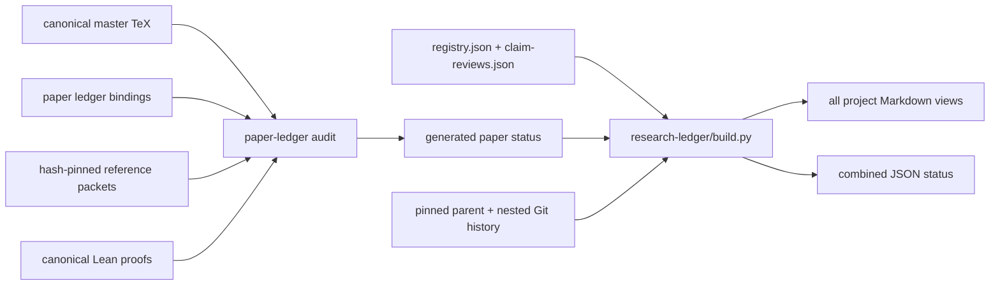

<!-- Generated by research-ledger/build.py; do not edit. -->

# Canonical infrastructure

Only PaperAudit can derive claim evidence. ResearchBuild may display that evidence but cannot manufacture it.
