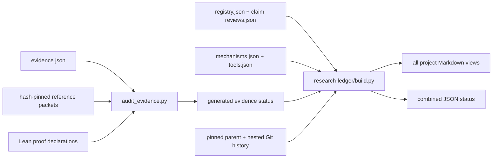

<!-- Generated by research-ledger/build.py; do not edit. -->

# Canonical infrastructure

Only the evidence audit can derive claim closure. The research build may display that evidence but cannot manufacture it.
