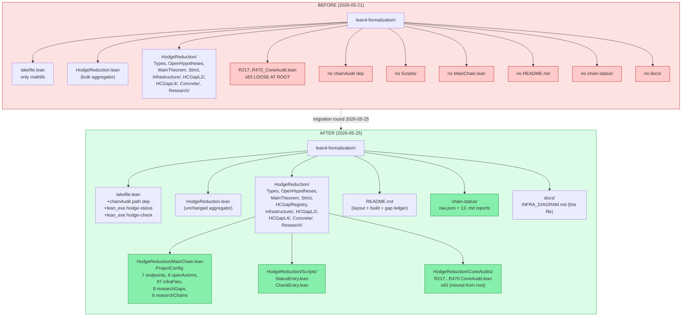
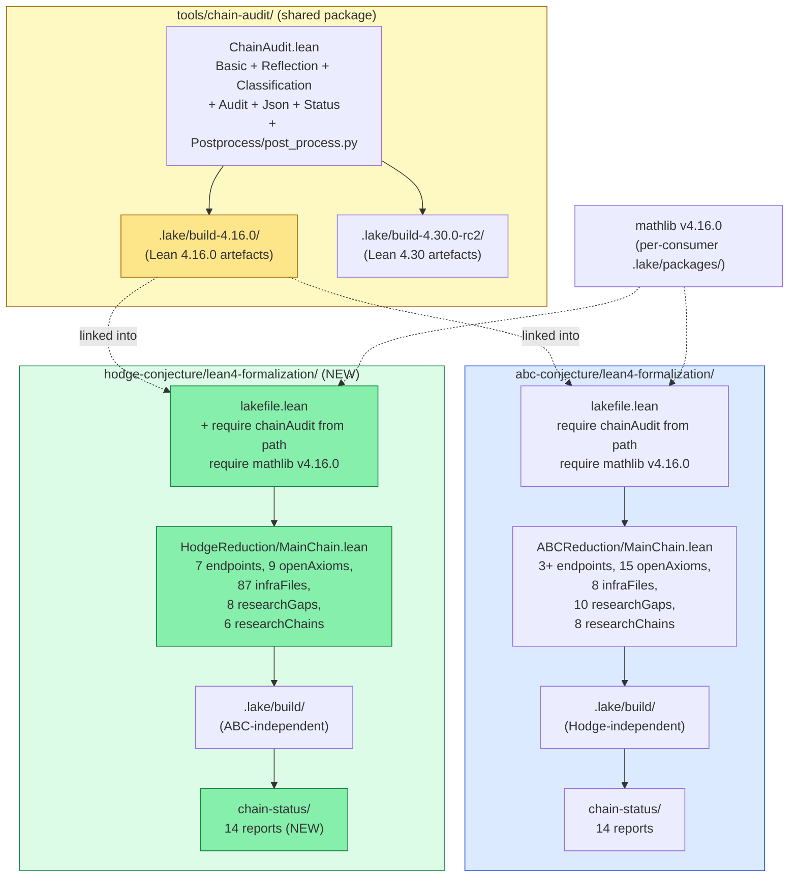
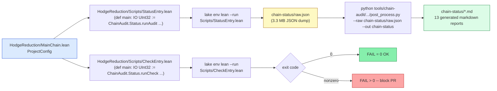
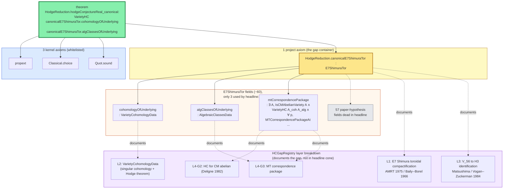
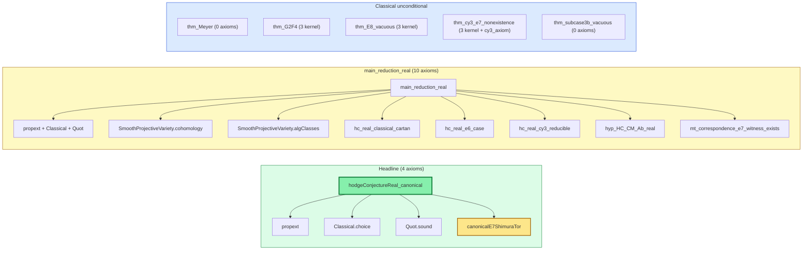

# Hodge ChainAudit Infrastructure — Architecture Diagram

Mirrors the `abc-conjecture/lean4-formalization` chain-audit pipeline.
Produced at infra-parity round 2026-05-25 (after `lake env lean --run
HodgeReduction/Scripts/StatusEntry.lean` + post-processor smoke test
passed with `0 fail / 9609 warn / 12 axioms / all whitelisted`).

## 1. Before / after layout of `lean4-formalization/`



## 2. Lake dependency graph (shared chainAudit, isolated build dirs)



**Key invariant from the chainAudit package's `lakefile.lean`:**

```lean
def chainAuditBuildDir : System.FilePath :=
  System.FilePath.mk (".lake/build-" ++ Lean.versionString)
```

This isolates chainAudit's compiled artefacts per Lean version, so both
ABC (Lean 4.16.0) and Hodge (Lean 4.16.0) safely share one source
checkout under `tools/chain-audit/` without colliding artefacts.  Each
consumer keeps its own default `.lake/build/` for its main library
(ABCReduction / HodgeReduction).

## 3. Audit pipeline (StatusEntry / CheckEntry → chain-status/)



## 4. Audit cone of the headline endpoint

`#print axioms HodgeReduction.hodgeConjectureReal_canonical` is now
the audit invariant.  Measured today by the StatusEntry smoke run:



## 5. Endpoint axiom summary (from `chain-status/axioms.md` today)



## 6. What this round fixed

| Issue | Before | After |
|---|---|---|
| Shared chainAudit dependency | absent | `require chainAudit from "../../../tools/chain-audit"` in `lakefile.lean` |
| `hodge-status` executable | absent | `lean_exe «hodge-status»` registered |
| `hodge-check` executable | absent | `lean_exe «hodge-check»` registered |
| Audit entrypoint | absent | `HodgeReduction/MainChain.lean` (7 endpoints, 9 axioms, 87 infra files, 8 gaps, 6 chains) |
| Status driver script | absent | `HodgeReduction/Scripts/StatusEntry.lean` (runs `runAudit`) |
| Check driver script | absent | `HodgeReduction/Scripts/CheckEntry.lean` (runs `runCheck`) |
| Project README | absent | `README.md` (layout + build + gap ledger entry points) |
| Architecture docs | absent | `docs/INFRA_DIAGRAM.md` (this file) |
| Stale package name in manifest | `"HodgePhantom"` | `"HodgeReduction"` (auto-fixed by `lake update`) |
| Loose root-level `R*_ConeAudit.lean` clutter | 83 files at project root | moved to `HodgeReduction/ConeAudits/` and listed as `infraFiles` |
| `chain-status/*` reports | absent | `raw.json` + 13 markdown reports generated, 0 hard failures |

## 7. Reproduction checklist

```powershell
cd e:\Dev\OpenExecution\research-line\academic-papers\millennium-problems\hodge-conjecture\lean4-formalization

# resolve deps + fetch mathlib cache (one-time per fresh checkout)
lake update                 # auto-runs `lake exe cache get` via mathlib post-update hook
# OR explicitly:
# lake exe cache get

# build the project (full project build is heavy; below is the fast path)
lake build HodgeReduction.MainChain   # builds the single audit-entry module
# OR for a full rebuild:
# lake build

# run the audit (writes chain-status/raw.json)
lake env lean --run HodgeReduction/Scripts/StatusEntry.lean

# post-process JSON to markdown reports (writes 13 .md files into chain-status/)
python ../../../tools/chain-audit/ChainAudit/Postprocess/post_process.py `
  --raw chain-status/raw.json --out chain-status

# CI gate: invariant check (exit code 1 on any FAIL finding)
lake env lean --run HodgeReduction/Scripts/CheckEntry.lean
```

Expected output of `Scripts/CheckEntry.lean` today (2026-05-25):

```
[HodgeReduction] invariant check
  total findings: 9609
  failures: 0
  warnings: 9609
```

The warnings are dominated by W5 (Prop-valued `def`-as-status markers
in HCGapL4 active attack waves) and W6 (vacuous `True`-conclusion
status theorems in the same waves) — both expected for active
research files and not affecting the headline cone.
